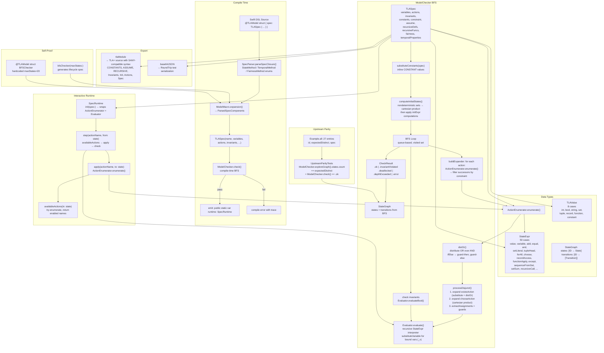

# SwiftTLA Architecture

## System Flow

## Component Inventory

| Component | File | Input | Output |
|-----------|------|-------|--------|
| `StateExpr` | StateExpr.swift | — | 50-case expression AST |
| `ActionExpr` | ActionExpr.swift | — | 8-case action AST |
| `TLAValue` | TLAValue.swift | — | 8-case runtime value |
| `Var<T>` | Var.swift | name | `.becomes`, `.stays`, `@dynamicMemberLookup` |
| `TLASpec` | TLASpec.swift | DSL builder | immutable spec struct |
| `Evaluator` | Evaluator.swift | StateExpr + state | TLAValue |
| `ActionEnumerator` | ActionEnumerator.swift | ActionExpr + state | [[String: TLAValue]] |
| `ModelChecker` | ModelChecker.swift | TLASpec | CheckResult + StateGraph |
| `SpecRuntime` | SpecRuntime.swift | TLASpec | StepResult |
| `SpecParser` | SpecParser.swift | SwiftSyntax AST | DSL types + ParsedSpecComponents |
| `ModelMacro` | ModelMacro.swift | struct source | extension + runtime property |
| `PrettyPrint` | TLASpec+PrettyPrint.swift | TLASpec | .tla string |
| `StateGraph` | StateGraph.swift | BFS data | states + transitions |

## Found Issues

1. **`ComputedInitDecl` dead code.** The `for comp in components` loop in `TLASpec`'s builder init has no handler for `ComputedInitDecl`. Created by `ComputedVariable()`, never converted to a `NamedVar`.

2. **`SymmetryDecl` dead code.** Same issue — no handler in builder loop. `SymmetrySet.canonicalize()` exists but `canonicalKey` is identity.

3. **Duplicate initial state computation.** `ModelChecker.computeInitialStates()` and `SpecRuntime.computeInitialStateMaps()` are identical (~20 lines each). Changes risk divergence.

4. **`substituteConstants` skips temporal properties.** Constants are inlined in variables, actions, invariants, assume, constraint — but `temporalProperties` passes through unsubstituted.

5. **Two OR-distribution algorithms.** `ActionEnumerator.distOr()` and `completeAction`'s `distributeActionOr()` are near-duplicates. The differs: `distributeActionOr` wraps existAction on each branch; `distOr` delegates expansion to `processDisjunct`.

6. **`Var.init` ignores the `value` parameter.** `init(_ name: String? = nil, value: T? = nil)` stores only `name`. The `value` parameter is unused. Intentional (init values go through `Variable()`) but misleading.

→ Fix by removing the `value` parameter from Var.init or adding a deprecation warning. Actually, Var is `@_disfavoredOverload`, but the `value` arg should just be removed since it's never stored.

7. **`SpecBuilder` missing overloads.** `buildExpression` is defined for `ComputedInitDecl` and `SymmetryDecl` at lines 226-227, but these components are never consumed in the builder init loop (see #1, #2).

→ Fix by adding handlers in the `for comp in components` loop, or remove the unused types.

8. **`Evaluator.substituteVariable` doesn't handle `.recursiveCall` args.** `recursiveCall` passes through but its args could reference the bound variable being substituted.
