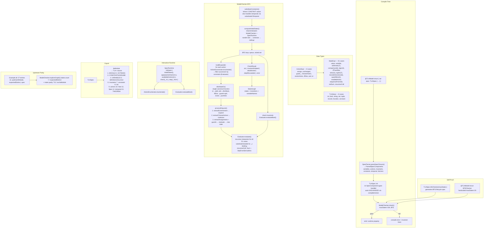

# SwiftTLA Architecture

## System Flow



## Component Inventory

| Component | File | Input | Output |
|-----------|------|-------|--------|
| `StateExpr` | StateExpr.swift | — | 51-case expression AST |
| `ActionExpr` | ActionExpr.swift | — | 8-case action AST |
| `TLAValue` | TLAValue.swift | — | 8-case runtime value |
| `Var<T>` | Var.swift | name | `.becomes`, `.stays`, `@dynamicMemberLookup` |
| `TLASpec` | TLASpec.swift | DSL builder | immutable spec with 14 component types |
| `Evaluator` | Evaluator.swift | StateExpr + state | TLAValue |
| `ActionEnumerator` | ActionEnumerator.swift | ActionExpr + state | successor states |
| `ModelChecker` | ModelChecker.swift | TLASpec | CheckResult + StateGraph |
| `SpecRuntime` | SpecRuntime.swift | TLASpec | StepResult (6 methods) |
| `SpecParser` | SpecParser.swift | SwiftSyntax | DSL types (7 public methods) |
| `ModelMacro` | ModelMacro.swift | struct source | extension + runtime property |
| `PrettyPrint` | TLASpec+PrettyPrint.swift | TLASpec | .tla string (13-step generation) |
| `distributeOr` | TLASpec+PrettyPrint.swift | ActionExpr | [[ActionExpr]] disjuncts |
| `completeAction` | TLASpec+PrettyPrint.swift | ActionExpr + vars | completed ActionExpr with per-branch UNCHANGED |
| `computeInitialStates` | TLASpec.swift | TLASpec | [[String: TLAValue]] |
| `substituteConstants` | TLASpec.swift | TLASpec | TLASpec with constants inlined |

## Package Structure

```
SwiftTLA (library)
├── SwiftParser, SwiftBasicFormat, SwiftSyntaxBuilder (swift-syntax 600)
│
├── SwiftTLAPlugin (macro)
│   └── SwiftTLA, SwiftCompilerPlugin, SwiftSyntax, SwiftSyntaxMacros
│
├── SwiftTLAMacros (library)
│   └── @attached(member) @attached(extension) macro TLAModel
│
├── SwiftTLAModels (library)
│   └── BFSChecker (@TLAModel), BFSExplorer
│
├── UpstreamParity (library)
│   └── Example.all + 27 port files
│
├── tlc-validate (executable)
│   └── emits .tlaModule for parity validation
│
└── SwiftTLATests (tests)
    └── 133 tests in 30 suites
```

## All Issues Resolved

| # | Issue | Resolution |
|---|-------|-----------|
| 1 | ComputedInitDecl dead code | Removed |
| 2 | SymmetryDecl dead code | Removed |
| 3 | Duplicate init state computation | Extracted shared `computeInitialStates()` |
| 4 | substituteConstants skipped temporals | Added `substituteInTemporal` |
| 5 | Two OR-distribution algorithms | Consolidated to single `distributeOr` |
| 6 | Var.init `value:` parameter | Intentional — type documentation |
| 7 | recursiveCall in substituteVariable | Already handled |
| 8 | SpecBuilder missing overloads | Removed with dead types |

## State (2026-08-07)

- **25/25** TLC parity
- **133** tests in **30** suites
- **51** StateExpr cases, **8** ActionExpr cases, **8** TLAValue cases
- **27** upstream parity ports
- **14** SpecComponent types handled by builder init
