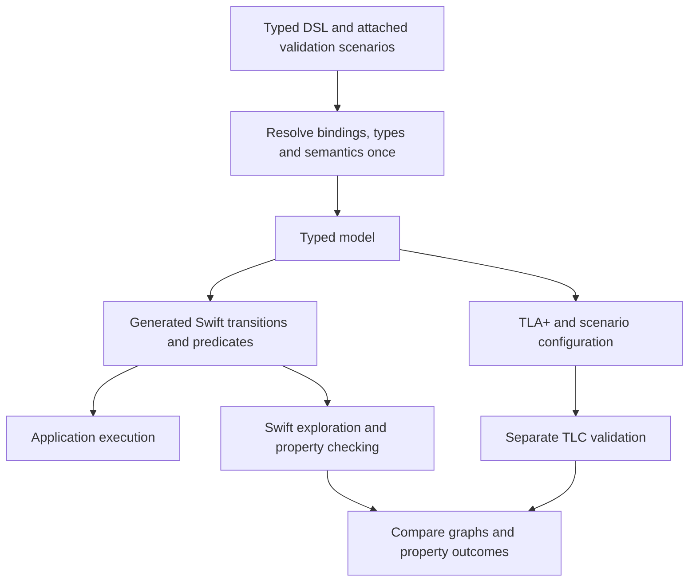

# SwiftTLA DSL implementation specification

Status: draft specification for the next implementation.

This document defines the target authoring API, semantic contracts, compiler
boundaries, and acceptance criteria. It is not a description of what happens to
exist today. Implementation must follow the completed specification rather than
preserve incidental behavior or introduce alternative APIs.

**Must** states a requirement; **must not** states a prohibition. Sections marked
**API pending** have required behavior but unresolved surface syntax. Their
examples are candidates, not approved signatures. Resolve the blockers in
section 11 before implementing the affected API. The specification is not ready
for implementation as a whole until those blockers are closed.

[Compiler design](Design.md) supplies the architecture and pinned corpus target.
[Generated machines](GeneratedMachines.md) describes the existing API and must be
updated as callers migrate. Code examples here must become compile-tested
fixtures once their API is settled.

## 1. Purpose

SwiftTLA is a Swift-native DSL for describing state machines, generating native
Swift implementations, and model checking those same implementations. Equivalent
TLA+ output lets TLC validate the implementation independently.

We are not building a Swift spelling of arbitrary raw TLA+. We do require enough
expressiveness for the full pinned, TLC-marked Validated Examples corpus described
in [Compiler design](Design.md#corpus-membership), including applicable variants
and configurations. Unsupported required features remain implementation work.

The authoring API must make three questions easy to answer:

1. What can this machine do?
2. What should be true of its states and executions?
3. Under which finite configurations should we validate those claims?

## 2. Architecture



Applications select transitions. Model checking explores transitions. Both use
the same generated Swift implementations. Do not add an expression interpreter
to provide a second execution path for Swift model checking.

TLC runs separately. Application execution, Swift exploration, and ordinary
Swift tests do not invoke it.

## 3. Required authoring contract

| Concern | Requirement |
| --- | --- |
| Authoring style | Use scoped `#spec`, `Algorithm`, `Each`, `Do`, variables, assignments, and explicit choices |
| Whole-step guard | `Do(label, when: condition)` guards the entire body |
| Nested guard | `When(condition)` guards the enclosing branch where local bindings are available |
| Removed spelling | `Await` must not exist as an API or compatibility alias |
| Properties | Express safety, positive reachability, and temporal claims without changing transition behavior |
| Validation | Associate named finite scenarios and expected outcomes with the DSL model |
| References | Use typed, model-owned handles between declarations |
| Names | Use Swift declaration names by default; allow an optional display-label override |
| Collections | Make typed collections primary; treat members as interchangeable only after an explicit author declaration |
| Step execution | Later statements see earlier assignments; the whole `Do` remains atomic |
| Scenario scope | Vary settings and collection members without changing generated state/action types |
| Stuck states | Report getting stuck before completion as a failure by default; scenarios may explicitly expect it |
| Types | Use familiar Swift value types; infer only an unambiguous type, otherwise require an explicit annotation; never guess or recover types at runtime |
| Fairness | Assume no promise that a ready process gets a turn unless the author explicitly declares it |
| Default checks | Check every declared property in each scenario; require explicit expected-failure overrides |
| Results | Represent counterexamples and reachability witnesses as checking results |

“SwiftUI-like” means readable composition, scoped builders, and focused modifiers.
It does not require an environment system, property-wrapper storage, or a generic
modifier type for every piece of metadata. Prefer storing metadata on the existing
declaration when that is sufficient.

## 4. Behavior: declarations and guarded steps

Retain typed, scoped variable handles. References between declarations must use
handles rather than another string lookup.

### Names and display labels

Use a declaration's Swift name as its default name in reports and diagnostics.
Authors must not repeat that name as a required string. For example, a property
bound as `mutualExclusion` must not also require `"MutualExclusion"`.

Allow an optional display label for a more readable report. A label changes
presentation, not declaration identity, type, references, or machine semantics.
References must continue to use typed declarations, not display-label strings.
Two declarations with the same display label must remain distinguishable.

Generate valid, unambiguous TLA+ identifiers from declaration identities and
source names. A display label containing spaces or punctuation must not become
an unchecked formal identifier.

The exact builder syntax for named bindings, optional labels, and declarations
without a Swift binding remains to be settled. The named string forms elsewhere
in this draft are provisional examples, not a requirement to repeat Swift names.
Anonymous declarations must have useful source locations in diagnostics; do not
invent another mandatory naming system merely to support them.

Inside `#spec`, scoped state declarations derive their names from immutable Swift bindings:

```swift
let count = scope.sharedVar(initial: 0)
let hour = scope.sharedVar(in: 1...12)
let visited = process.localVar(initial: false)
```

The same rule applies to specification, algorithm, process, and procedure scopes.
`Assign` changes the state value, not the handle binding.
An initial string value is data and does not supply a declaration name.
The macro supplies the internal `_name` argument for the formal builder boundary.
The former positional-name signatures are not supported.
State display labels and anonymous declarations still require the remaining B-02 decisions.

Swift backticks escape keywords but are not part of declaration identity.
For example, a state binding spelled `` `repeat` `` has the formal name `repeat`.
References, parameter bindings, and property selections use the same unescaped identity.

The whole-step guard syntax is:

```swift
Do(Step.increment, when: count < limit) {
    Assign(count, to: count + 1)
    Goto(Step.increment)
}
```

The guard controls the entire transition. When false, the step has no successor;
none of its assignments or control transfers takes effect. It neither suspends a
Swift task nor starts polling. An omitted guard imposes no additional entry
condition, although conditions inside the body may still disable a branch.

Keep a nested guard where it needs a value bound inside the body:

```swift
Do(Step.select) {
    Choose(1...3) { candidate in
        When(candidate != selected)
        Assign(selected, to: candidate)
    }
}
```

Each accepted candidate contributes a possible successor. A choice must not
silently select the first member. Application dispatch must report ambiguity
unless the caller has supplied enough information to select a transition.

### Independent atomic steps

Direct-TLA models can declare `Do` directly inside scoped `#spec`.
`Do` returns an `AtomicStep`, which both specification and algorithm builders accept.
At specification scope, each step declares an independent action over `scope.sharedVar` state.
No program counter, source-order scheduling, or termination action is added.

```swift
#spec("IndependentCounter") { scope in
    let count = scope.sharedVar(initial: 0)
    Do(Step.increment, when: count < 2) {
        Assign(count, to: count + 1)
    }
    Do(Step.reset, when: count == 2) {
        Assign(count, to: 0)
    }
    Validation("Complete") {}
}
```

Independent steps retain the same ordered assignments, guards, choices, saved values, assertions, and rollback behavior as algorithm steps.
An unchanged state variable retains its value.
No enabled step means deadlock, not implicit completion.
`Goto`, `Call`, `Return`, and `Stop` require an enclosing `Algorithm`, including inside nested branches.
Duplicate step labels and non-Boolean guards fail compilation.
Current implementation limitation: mixed independent steps and `Algorithm` declarations fail explicitly.
This restriction does not satisfy B-06. Required composition remains unfinished.

Acceptance requires generated execution, complete native graphs, TLA+ export without synthetic control state, and independent hosted TLC evidence.
The direct model must not acquire an authored PlusCal algorithm.

An immutable binding can retain an independent `Do` step for later references.
The binding does not register the step. A separate expression registers it once:

```swift
let finish = Do(Step.finish, when: count == 0) { Skip() }
finish
let Finished = Temporal()
Finished(.eventually(finish.enabled))
WeakFairness(finish)
```

`step.enabled` tests whether the step has a successor, including its guards and local choices.
Parameterized steps quantify over their configured arguments. An empty argument domain makes the step disabled.
`WeakFairness(step)` and `StrongFairness(step)` refer to that same registered action.
Missing registration and duplicate registration fail compilation.

#### Parameterized independent steps

`Do(label, over: domain) { member in ... }` declares one action argument.
`Do(label, over: firstDomain, secondDomain) { first, second in ... }` declares two action arguments.
Each domain is a typed finite set of immutable values or model parameters.
The closure must name each argument. These names supply the generated action argument labels.
The compiler retains each argument type and binding identity through native generation and formal export.

```swift
Do(Step.pour, over: jugs, jugs) { source, destination in
    When(source != destination)
    let amount = contents[source]
    Assign(contents[source], to: 0)
    Assign(contents[destination], to: contents[destination] + amount)
}
```

The domains define a Cartesian product. Guards select enabled argument combinations.
An empty domain produces no action instances. It does not remove properties or disable the default deadlock check.
Assertions quantify over all argument combinations and preserve the guards and ordered assignment semantics.
These declarations belong directly in `#spec`. They do not create processes or control state.
Inside `Algorithm`, `Each` declares process arguments and `With` declares local choices.

`Do(Step.pick, over: mutableState) { item in ... }` is invalid because its domain depends on mutable state.
Missing, duplicate, or anonymous closure arguments are invalid.
An unresolved element type is a compile-time error, including for empty sets without a declared element type.
Acceptance requires argument-sensitive graph comparison, configured empty domains, and diagnostics for each rejection rule.

### Atomicity and assignment semantics

A `Do` block executes statements in order, like normal Swift. Later statements
see values assigned by earlier statements. The whole block remains one atomic
transition: other processes cannot observe or act on intermediate values.

```swift
// With x initially 1, the resulting state has x == 2 and y == 2.
Do(Step.copy) {
    Assign(x, to: x + 1)
    Assign(y, to: x)
}
```

Repeated assignments are allowed and execute in order. Conditions, nested
`When` guards, and choice domains read the values available at their position in
the block. The `when:` condition on `Do` reads the entry state.

A failed nested guard disables that candidate transition entirely. Earlier
assignments in that candidate must not leak into the machine state. Evaluation
errors must also leave the input state unchanged and be reported explicitly.
Neither a blocked candidate nor an error silently commits a partial update.

The compiler must resolve these ordered reads and writes once, then derive both
native Swift execution and equivalent TLA+ next-state expressions from that
result. Intermediate compiler values are not separately observable model states.

**Migration requirement:** this changes the existing simultaneous-update
contract. Existing swaps and other pre-state-dependent assignments must capture
the original values explicitly before writing. Audit and migrate every affected
caller in the same implementation; do not retain an alternative legacy `Do` mode.
Inside a `#spec` step, ordinary `let` saves a value at that position. Later
assignments do not change it, and nested scopes may shadow the saved name.
Explicit type annotations are checked by Swift. `Let(value) { saved in ... }`
uses the same saved-value semantics.

```swift
Do(Step.swap) {
    let originalLeft = left
    Assign(left, to: right)
    Assign(right, to: originalLeft)
}
```

Preserve the distinction between a blocked step, deadlock, normal termination,
and stuttering. An algorithm that loops back to a guarded step can deadlock when
the guard becomes false; reaching a bound does not automatically mean termination.

### Getting stuck and finishing

Checking must report a reachable stuck state as a failure by default. A state is
stuck when the machine has not finished and no executable transition is enabled.
Authors must not need to add a declaration to enable this check.

Normal completion is not a stuck state. Completion must be determined from the
model's defined control/termination behavior, not inferred from the absence of
successors. A synthetic stuttering edge must not hide an unfinished stuck state.
Having enabled transitions does not prove eventual progress; temporal claims
remain responsible for detecting executions that run forever without progressing.

A validation scenario can explicitly expect getting stuck, for example to test
a deliberately broken protocol. This expectation changes only the scenario's
pass/fail decision. It must not change transitions, hide the deadlock result, or
turn a timeout or incomplete exploration into an expected failure.
The scenario modifier is `.expectDeadlock(.violated)`.

Both Swift checking and separate TLC validation must apply this default while
preserving normal termination semantics. Complete graph capture must still
finish independently of any property run that stops on the first stuck state.

## 5. Claims: safety, reachability, and progress

| Declaration | Meaning | Positive result requires |
| --- | --- | --- |
| `Invariant()` handle with a registered predicate | Every reachable state satisfies the predicate | Complete exploration with no violation |
| `Reachable()` handle with a registered predicate | Some reachable state satisfies the predicate | A valid execution reaching a matching state |
| `Eventually` | Every allowed execution eventually satisfies the predicate | Complete temporal analysis under the declared semantics |
| `LeadsTo` | Whenever a premise holds, its consequence eventually follows | Complete temporal analysis under the declared semantics |

`Reachable()` creates the named handle for a positive reachability claim.
Its predicate registration selects the matching states. Do not add a `Counterexample` declaration that asks
users to negate their goal. Counterexamples name results of failed properties.
Some property-handle decisions remain unresolved. Retain the temporal composition
capabilities needed by the corpus; these four forms do not limit expressiveness.

### Invariant handles across scopes

The invariant forward-declaration syntax is `let safe = Invariant()` inside `#spec`.
The macro supplies the Swift binding name. The declaration creates an immutable handle, not a registered predicate.
The signature is `Invariant() -> InvariantHandle`.
The handle exposes `callAsFunction(@InvariantBuilder _ body: () -> StateExpr) -> InvDecl`.
The expression `safe { predicate }` registers the predicate in its enclosing specification, algorithm, or process builder.
An outer scenario can select this same handle with `.checking(only: [safe])` or reference it with `.expect(safe, .satisfied)`.
The predicate retains its inner scope and any process-member quantification.

```swift
let safe = Invariant()
Algorithm("Worker", scoped: { scope in
    let value = scope.sharedVar(initial: 0)
    Do(Step.wait) { Goto(Step.wait) }
    safe { value == 0 }
})
Validation("Safety") {}.checking(only: [safe])
```

A bare forward handle is not a builder component. A scenario reference without a registered predicate fails compilation.
Two predicate registrations for the same handle also fail compilation, even when their bodies agree.
For example, `safe { true }` followed by `safe { false }` is invalid.
An unused handle registers no claim, like an unused bound predicate declaration.
### Property display labels

Each forward constructor accepts `label: String? = nil` before its macro-supplied name.
For example, `let safe = Invariant(label: "Mutual exclusion")` keeps `safe` as the declaration name.
This applies to `Invariant`, `Reachable`, `Always`, `Eventually`, `AlwaysEventually`, `EventuallyAlways`, `LeadsTo`, and `Temporal`.
Inside `#spec`, an explicit label must be a nonempty string literal without interpolation.
An omitted label uses the Swift declaration name for display.

Refinements use the same naming and label rules.
For example, `let refines = Refinement(instance: target, mappings: mappings, label: "Abstract behavior")` keeps `refines` as its formal name.
The separate `refines` builder expression registers this declaration.
The macro supplies the internal `_name` argument from the Swift binding.
The former `Refinement(name: ...)` spelling is not supported.

The label is immutable presentation metadata on the existing property reference.
It does not select a property, replace its identity, or enter a formal identifier.
Generated models expose `propertyDisplayNames: [Property: String]` separately from `formalPropertyNames`.
Scenario evidence retains both mappings without using labels as result keys.

Two properties with the label `"Safety / progress"` must retain distinct generated cases, formal names, selections, and outcomes.
A numeric label, an interpolated label, or a duplicate label argument must fail compilation.
Anonymous declaration names and labels for other declaration kinds remain part of B-02.

### Reachability handles across scopes

The forward declaration is `let solved = Reachable()` inside `#spec`.
Its signature is `Reachable() -> ReachableHandle`.
The handle exposes `callAsFunction(@InvariantBuilder _ body: () -> StateExpr) -> ReachableDecl`.
The expression `solved { predicate }` registers one positive claim in its enclosing specification, algorithm, or process builder.
The handle follows the invariant identity, naming, registration, and `Sendable` rules.
Outer scenarios can select the handle or declare `.expect(solved, .violated)` without changing its meaning.

Inside `Each`, the claim requires one reachable state where every member satisfies the predicate.
The compiler universally quantifies the state predicate before the reachability check.
Separate executions or separate states cannot supply witnesses for different members.
An empty population gives a true predicate, but reachability still requires a reachable state.
Process-local state and typed member bindings retain their scope through both backends.

Acceptance includes two processes that take exclusive ownership.
Each process can own the resource, but the all-member ownership claim is unreachable.
A separate claim for either owner is reachable and retains a valid witness.
A claim that every process has visited succeeds only after both visits occur in one execution.
Missing definitions, duplicate registrations, foreign handles, bare handles, and non-Boolean predicates must fail compilation.
Complete native and hosted TLC evidence remains required for this contract.

### Temporal handles across scopes

Temporal forward declarations use the same identity and registration rules as invariant handles.
This contract decision requires implementation and acceptance evidence before completion.

| Constructor signature | Handle definition | Temporal meaning |
| --- | --- | --- |
| `Always() -> TemporalHandle` | `claim(predicate)` | `[]predicate` |
| `Eventually() -> TemporalHandle` | `claim(predicate)` | `<>predicate` |
| `AlwaysEventually() -> TemporalHandle` | `claim(predicate)` | `[]<>predicate` |
| `EventuallyAlways() -> TemporalHandle` | `claim(predicate)` | `<>[]predicate` |
| `LeadsTo() -> LeadsToHandle` | `claim(premise, consequence)` | `premise ~> consequence` |

`TemporalHandle` exposes `callAsFunction(_ predicate: some TypedExpression<Bool>) -> TemporalDecl`.
`LeadsToHandle` exposes `callAsFunction(_ premise: some TypedExpression<Bool>, _ consequence: some TypedExpression<Bool>) -> TemporalDecl`.
Both handles conform to `ModelProperty` and have compiler-checked `Sendable` conformance.
Neither handle is a builder component before its definition.
Each constructor requires a named `let` binding inside `#spec`, which supplies the default name without a duplicate string.

The definition registers one claim in its enclosing specification, algorithm, or process builder.
A process definition retains the member binding, local state, and universal temporal quantification described in this section.
Outer scenarios reference the handle, not the predicate body or a formal name string.
An expected violation changes only the validation verdict. It does not alter fairness, transitions, or the selected checks.

For example, the existing `RecurringPopulation` declarations supply `members`, `value`, and `Step` in this excerpt:

```swift
let EachRecurs = AlwaysEventually()
Algorithm("Toggle") {
    Each(members, fairness: .weak) { member in
        While(Step.toggle, true) {
            Assign(value, to: 1 - value)
        }
        EachRecurs(value == member)
    }
}
Validation("Outside cycle") { Bind(members, to: Set<Int>([2])) }
    .expect(EachRecurs, .violated)
```

Acceptance requires the expected violation and actionable native and TLC lassos for member `2`.
The successful and empty populations must retain their existing outcomes.
A missing definition, duplicate registration, or foreign handle must fail compilation.
Wrong predicate types and wrong argument counts must fail Swift compilation.
For example, a handle from `LeadsTo()` cannot accept one predicate, and a handle from `Eventually()` cannot accept two.
These forms do not limit the temporal composition required by the corpus.

`Temporal() -> TemporalPropertyHandle` declares a handle for a composed temporal claim.
Its definition accepts `TemporalCondition<Expr<Bool>>` with typed Boolean predicates.
Swift rejects integer predicates and raw `TemporalCondition<StateExpr>` values at this handle.
The supported compositions include `.all([...])` and `.conditional(predicate, then: condition, else: condition)`.
Both branches can contain further compositions or the temporal forms in the table.
The member form `premise.leadsTo(consequence)` returns the same typed condition and can appear inside either composition.

```swift
let hypothesis = Temporal()
hypothesis(.conditional(value == 0,
    then: .eventually(value == 1),
    else: .eventually(value == 2)))
```

The conditional predicate selects a branch at the initial state of each behavior.
That branch remains selected when the state changes or paths from different initial states merge.
The native checker evaluates branch predicates only in states reachable from the initial states that selected that branch.
TLA+ export retains the temporal `IF ... THEN ... ELSE ...` expression.
A counterexample retains the initial state that selected the violated branch.
Incomplete exploration cannot satisfy a conditional claim.

### Before and after values

`TemporalCondition<Expr<Bool>>.alwaysStep(on:_:)` defines a transition claim over a typed expression.
The closure receives two `Expr<Value>` arguments and returns a typed Boolean expression.
The arguments describe the selected value before and after one transition.
For example:

```swift
let decreases = Temporal()
decreases(.alwaysStep(on: can) { before, after in
    after.black + after.white < before.black + before.white
})
```

The claim means `[][predicate]_value`.
A transition that preserves the selected value satisfies the claim without evaluation of the closure predicate.
This includes implicit stuttering and transitions that change only other variables.
Other transitions must satisfy the predicate on their actual before and after values.
Declared fairness still determines the permitted infinite behaviors.
The claim can appear inside `.all` and either branch of `.conditional`.

The compiler retains a typed successor-state expression until native generation or TLA+ serialization.
It does not encode successor reads in variable names.
Native checking uses generated predicates over the same snapshots and transitions as application execution.
A counterexample includes the violating transition and a fair continuation.
A successor read in an initializer, invariant, state liveness predicate, or another successor read fails compilation.
The existing state-only interpreter cannot check transition predicates and reports an explicit failure.

Acceptance includes nominal record fields, scalar projections, composite values, stuttering, multiple initial states, and mixed temporal compositions.
A non-Boolean result or a closure without two distinct parameters fails compilation.
Independent hosted TLC validation must retain complete graphs and both satisfied and violated property outcomes.

Reachability and eventual progress are different claims. A puzzle can have a
solution even when some executions loop forever without finding it.

Write puzzle goals positively:

```swift
Reachable("Solved") {
    board.isSolved
}
```

Here `board.isSolved` is illustrative shorthand for a supported typed predicate,
not permission to execute an arbitrary Swift method during formal export.

The TLC reachability check must test the negated predicate as an invariant. A valid counterexample then witnesses reachability. Complete
exploration without that counterexample establishes unreachability for the
configuration. Translate the result back to the user's positive claim.

### Getting a turn: explicit fairness required

There is no default promise that an enabled process or action will eventually
run. Unless the author explicitly declares fairness, checking must consider
executions that ignore it forever. The compiler and checker must not infer this
promise from a process declaration, a progress property, or an application
scheduler.

An explicit promise for a continuously enabled process/action corresponds to
weak fairness. A stronger promise for one enabled repeatedly, but not continuously,
is distinct and must also be explicit. Independent steps and `Next` use the declarations below.
Other scope references still require the remaining B-04 decisions. Declared fairness must be preserved in temporal checking
and TLA+ export; it is not a runtime scheduling mechanism.

Fairness belongs to behavior because it changes allowed executions.

`WeakFairness(step, on: value)` and `StrongFairness(step, on: value)` select a typed current-state projection.
`WeakFairnessNext(on: value)` and `StrongFairnessNext(on: value)` apply that projection to the complete transition relation.
An eligible transition must change the projection. Changes to other state do not count as fairness progress.
Without `on:`, the projection contains the complete execution state.
The compiler preserves the projection through native checking, refinement checking, and TLA+ export.
These declarations do not change the generated application transitions or scheduler.

### Temporal claims for each process member

A temporal declaration inside `Each` applies separately to every member of that
process population. Its predicate can reference the member and process-local state.
The population must depend only on constants or immutable model parameters.

```swift
Each(members, fairness: .weak) { member in
    While(Step.toggle, true) {
        Assign(value, to: 1 - value)
    }
    AlwaysEventually("EachRecurs", value == member)
}
```

This claim means `\A member \in members: []<>(value = member)`.
It does not require all members to satisfy the predicate simultaneously.
An empty population satisfies the claim after complete exploration.
The declaration produces one property result, with a counterexample if any member fails.
Fairness remains explicit and independent of the claim.

The compiler retains typed member bindings through native generation and TLA+ export.
Generated predicates capture native member values. They do not invoke an expression interpreter.
Outer validation declarations can reference invariant handles through the forward-declaration syntax in this section.
Temporal scope references use the temporal forward-declaration contract in this section.
Fairness and symmetry still require the remaining B-04 decisions and evidence.

### Configured authored PlusCal export

Generated TLA+ and authored PlusCal exports use the same resolved typed model and scenario configuration.
Model parameters remain symbolic constants in both exports.
The compiler retains typed process bindings, local initializers, procedure arguments, and statement expressions until rendering.

The renderer gives state-dependent helpers explicit state arguments, including transitive dependencies through recursive calls and domain guards.
This keeps helper declarations independent of the placement of translated PlusCal variables.
An unsupported export reports a diagnostic. It does not recompile the source or use an interpreter.
Hosted translation and complete graph comparison remain required evidence for export equivalence.

### Interchangeable members: explicit declaration required

The checker must treat collection members as distinct unless the author explicitly
declares them interchangeable. It must not discover or enable symmetry reduction
automatically. A typed collection does not imply interchangeability.

An explicit symmetry declaration permits a reduction; it does not require the
checker to use it. The checker must still enforce the restrictions of the chosen
checking mode. If a requested reduction cannot be justified or supported, report
that explicitly rather than claim successful reduced validation. Checking the
unreduced model remains valid.

Ordering, a distinguished member, or identity-dependent behavior can make members
non-interchangeable. An explicit declaration does not excuse an unsound reduction.
The exact declaration syntax and validation rules remain to be specified.

## 6. Validation scenarios attached to the model

### Configuration is part of the DSL

The DSL must declare validation configuration beside the algorithm. Native
validation and TLA+ export must consume the same resolved configuration.
Authors must not repeat its bindings or check selection in a handwritten
registry or generated `.cfg` file.

An imported module can use a model parameter for its finite domain.
For example, `Import(ZSequences.module, configuring: ZSequences.boundedNaturalNumbers(through: maximum))` supplies `0..maximum` to the imported `Nat` operator.
The bound accepts an integer literal or a typed integer expression.
The expression must not depend on machine state or enabled actions.
Scenario bindings supply the parameter value in both native execution and TLA+ export.
The former positional range argument is not supported.

The configuration must express the semantic choices of upstream TLC
configurations, including parameter bindings, state constraints, action
constraints, property selection, and deadlock selection. An unsupported choice
must produce an explicit diagnostic. A backend must not ignore a choice or
substitute its default.

By default, exploration captures the complete reachable graph and evaluates
every declared property, with deadlock checking enabled. Property violations
must not stop graph capture. Normal completion retains the semantics in
section 4. Resource limits remain runner controls, not model constraints.

State constraints select the initial states and successors that exploration
retains. They do not change the executable transition relation. Deadlock checks
use successors before constraint filtering. Invariant checks include all initial
states and generated successors, including excluded candidates. These rules
match the [pinned TLC checker](https://github.com/tlaplus/tlaplus/blob/867aefb69ffc2452031292587b389d1fc3eb43ff/tlatools/org.lamport.tlatools/src/tlc2/tool/ModelChecker.java#L406-L451).

A constrained graph can omit the final state of a valid invariant counterexample.
The result must retain that state and its incoming transition separately from
the constrained graph. A backend that cannot represent this witness must fail
explicitly. It must not discard the violation or add excluded states to graph
equivalence inputs.

An upstream comparison must preserve the effective upstream check selection,
including an explicit `CHECK_DEADLOCK FALSE`. Such a comparison establishes
agreement for that selection. It does not establish results for omitted model
properties or complete scenario validation under AC-16. Reports must identify
the selected checks and separate these claims.

An expected deadlock differs from a disabled deadlock check. The former requires
a deadlock result and a valid witness. The latter establishes no deadlock
verdict. Neither choice permits a truncated graph to pass equivalence validation.

The check-selection syntax is:

```swift
Validation("Upstream selection") {
    Bind(processCount, to: 3)
}
.checking(only: [exclusion])
.checkingDeadlock(false)
```

`checking(only:)` accepts registered property handles from the same model.
An empty array selects no properties. Without this modifier, the scenario selects
every declared property. `checkingDeadlock(_:)` accepts a Boolean literal and overrides
the model's deadlock selection for this scenario.

Duplicate selection modifiers, duplicate handles, foreign handles, and expectations
for unselected checks produce diagnostics. Modifier order does not change these rules.
Selected properties default to an expected satisfied outcome. Unselected properties
have no outcome or expectation. The native checker must not evaluate their predicates.

Generated scenarios expose a typed `ModelChecks<Property>` value through `checking`.
Native exploration and export consume this same value. Selection does not change
application transitions, graph completeness, or resource limits. Evidence reports
selected and omitted checks separately from complete scenario validation.

`.behavior(.specification)` is the default behavior choice. It uses the model's
initial states, transition relation, and declared fairness. Export selects
`SPECIFICATION Spec`.

`.behavior(.initialAndNext)` selects `INIT Init` and `NEXT Next` instead.
Native checking uses the same initial states and transitions, without the fairness
conjuncts from `Spec`. Application transitions and complete graph capture do not change.
Temporal and refinement outcomes can change because the permitted infinite behaviors differ.

Generated scenarios retain this choice as a typed `ModelBehavior` value.
Native checking and export consume the same choice. Duplicate behavior modifiers
produce a diagnostic. Expected outcomes do not select or alter behavior.
Evidence identifies the selected behavior separately from property and deadlock coverage.

### Declaration syntax

#### Counter parameter contract

The parameter surface for Counter is:

```swift
let limit = scope.parameter(as: Int.self, in: 0...100)
let stopAtLimit = scope.parameter(as: Bool.self)
```

`parameter(as:in:)` declares an immutable, typed model parameter. The integer
overload accepts a closed range as its legal domain. The generic overload accepts
a typed set expression with the same element type as the parameter.
`parameter(as: Bool.self)` uses the complete Boolean domain.
Legal domains can depend on immutable parameters, but not on machine state or
enabled actions. The compiler must reject these dependencies, including those
inside helper functions.

The Swift binding supplies the declaration name. The macro retains its source
location and assigns a model-owned identity. A parameter reference retains this
identity through lowering. A display label must not replace it.

Every scenario must bind each required parameter exactly once. The value must
have the declared Swift type and belong to the legal domain. A parameter is not
a state variable and cannot be an assignment target. Parameter values remain
configuration data, not substituted literals in the compiled transition program.

The generated machine owns one immutable `Configuration` value. Its generated
initializer accepts one typed argument per parameter and rejects values outside
their legal domains. Application execution and exploration both receive this
configuration. Every configuration uses the same generated `State`, `Action`,
and `Snapshot` types.

For the declarations above, the generated entry points are:

```swift
try Counter.Configuration(limit: 2, stopAtLimit: true)
try Counter.initialMachines(configuration: configuration)
try Counter.makeMachine(configuration: configuration)
try Counter.render(configuration: configuration)
```

The first expression succeeds. `Counter.Configuration(limit: 101,
stopAtLimit: true)` throws a domain error. A string supplied for `limit` fails
Swift type checking. A binding to a parameter from another model fails model
validation, even when its name and type match.

`render(configuration:)` returns `RenderedSpecification`. The macro renders the
resolved typed program once. The generated method combines that module with the
supplied configuration at the serialization boundary. It must not compile the
specification again or interpret expressions at runtime.

Parameters remain symbolic constants in the TLA+ module. Different configurations
change the TLC constant bindings, not the transition module. Legal domains remain
explicit module assumptions. Export retains every declared check and the model's
deadlock selection. It does not turn an expected failure into a different model.

For example, valid limits of 2 and 4 produce identical transition modules and
different constant bindings. An invalid limit fails `Configuration` construction
before export. Unsupported module closures must fail explicitly, without partial
output or a fallback to an earlier compiler representation.

This contract settles scalar parameter declarations and scenario bindings for Counter.
Parameter-dependent collection domains still require the remaining B-01 decisions.
They must use these same identities and configuration values.

#### Set-valued parameters

Ordinary Swift sets can supply parameter values, legal domains, and model state:

```swift
let nodes = scope.parameter(as: Set<Int>.self,
    in: Set<Set<Int>>([Set<Int>([1]), Set<Int>([1, 2, 3])]))
let quorum = scope.parameter(as: Int.self, in: IntRange(1, through: nodes.cardinality))
let selected = scope.sharedVar(initial: Set<Int>([]))

Validation("Three nodes") {
    Bind(nodes, to: Set<Int>([1, 2, 3]))
    Bind(quorum, to: 2)
}
```

The generated configuration stores `Set<Int>`. Its initializer checks both the
set domain and the dependent quorum domain. Scenario bindings use the same
configuration initializer. Different populations retain the same generated
state and action types. Export changes constant bindings, not the transition module.

Set expressions support membership, cardinality, subset checks, union,
intersection, difference, insertion, and removal. These operations preserve the
declared element type. Compilation rejects distinct Swift members that collapse
to one formal value. A set declaration does not imply symmetry.

The next section defines configurable `Each` populations.
Replacement of fixed `ModelCollection` declarations remains part of B-01.

#### Ordinary Swift arrays

Swift arrays serve directly as model state and configuration values.
The compiler preserves element order, repeated elements, and nominal element types.

```swift
let input = scope.parameter(as: [Int].self,
    in: Set<[Int]>([Array<Int>([]), Array<Int>([2, 1, 2])]))
let row = scope.sharedVar(initial: Array<Int>([]))
```

Array expressions support append, concatenation, indexed reads, indexed removal,
selection, length, head, and folds through the shared sequence operations.
These operations retain the array type. They do not require a `TupleExpr` value.
`Sequences` and `SortedSequences` produce domains of ordinary Swift arrays.
Set operations accept different set representations with the same element type and preserve the receiver type.
DSL sequence indices start at one, as in TLA+.
Generated application state uses ordinary Swift arrays, whose indices start at zero.
The formal boundary rejects invalid element values instead of discarding them.

#### Configured sequence domains

The bounded sequence builders accept typed set expressions for their elements and lengths.
Both domains can depend on parameters:

```swift
let row = scope.sharedVar(in: Sequences(of: members, lengths: IntRange(0, through: limit)))
let sorted = scope.sharedVar(in: SortedSequences(of: members, lengths: lengths))
let zeroBased = scope.sharedVar(in: ZeroBasedSequences(of: members, lengths: lengths))
```

`SortedSequences` requires integer elements and retains only nondecreasing sequences.
`ZeroBasedSequences` uses indices from zero. The other builders use TLA+ sequence indices from one.
An empty element set admits the empty sequence when the length domain includes zero.
It admits no positive-length sequences.
An empty length domain admits no sequences.

The compiler retains both domain expressions and their lexical bindings in formal comprehensions.
It does not enumerate their Cartesian products during source construction.
Generated initial states preserve element types, including nominal enums.
Different configurations retain the same generated types and TLA+ module.
Immutable `let` bindings inside `Algorithm` retain their formal expressions, including parameter references and references to earlier bindings.
The parser does not evaluate these expressions as closed constants.

Lengths must be nonnegative integers. The builders also accept compile-time ranges such as `0...2`.
Compilation rejects negative lengths in these ranges.
Evaluation fails if a configured length set contains a negative member, even if other members are valid.
The compiler does not discard invalid lengths or convert them to zero.

#### Parameter-dependent function domains

`Functions(from:to:)` accepts typed finite set expressions, including parameter-dependent ranges.
Each member is a total function over exactly the supplied domain.
Generated Swift stores these values as typed dictionaries.
Function-space membership rejects missing keys, extra keys, and values outside the supplied range.

```swift
let values = algorithm.sharedVar(in: Functions(
    from: IntRange(0, through: size - 1), to: Set<Int>([0, 1])))
```

An empty domain has one function: the empty function, even when the range is empty.
A nonempty domain with an empty range has no functions.
The compiler preserves parameter identities through native generation and TLA+ export.
Dictionary projections reject invalid keys, invalid values, and collisions between Swift and formal key identities.

Dictionary expressions expose `.keys` as a typed set. An empty dictionary has an empty key set.
Native generation and TLA+ export preserve the key type and domain expression.
`ForAll(in:)` and `Exists(in:)` accept typed Swift sets and retain their element types.
`Assume` and `Constraint` resolve parameter and state handles in their declaration scope.

`Functions(from: 1, to: Set<Int>([0, 1]))` is invalid because its domain is not a set.
Finite enum domains retain the existing `Functions(from: Key.all, to: ...)` contract.

`Dictionary<Key, Value>.mapping(over:)` constructs one function over a typed finite domain.
The closure binds each key and can read parameters or earlier variables.
An empty domain produces an empty dictionary without evaluation of the closure body.

```swift
let f = algorithm.sharedVar(initial: Dictionary<Int, Int>.mapping(
    over: IntRange(0, through: n * 2)) { _ in -1 })
```

The compiler retains the domain, key binding, and body as one typed function expression.
Native generation and TLA+ export use that expression.

Ordinary dictionary literals can bind function-valued model parameters:

```swift
let capacity = scope.parameter(as: [String: Int].self,
    in: Functions(from: jugs, to: Set<Int>([3, 5])))
Validation("Two jugs") {
    Bind(jugs, to: Set<String>(["small", "big"]))
    Bind(capacity, to: ["small": 3, "big": 5])
}
```

The parameter type supplies the key and value types, including for `[:]`.
`Dictionary<String, Int>()` also declares a typed empty dictionary.
The compiler rejects duplicate literal keys. Configuration validation rejects missing keys, extra keys, and values outside the function range.
The compiler retains dictionary entries as expressions until formal serialization. It does not turn them into a string-keyed model schema.

#### Configured process populations

`Each` accepts a typed set expression. Its element type supplies the process
identifier type. Both existing closure forms retain their meaning:

```swift
Each(nodes) { member in
    Do(Step.visit) {
        Assign(selected, to: selected.inserting(member))
    }
}

Each(nodes, scoped: { member, process in
    let visited = process.localVar(initial: false)
    Do(Step.visit) {
        Assign(visited, to: true)
    }
})
```

The population expression can depend on immutable parameters and supported
helpers. It cannot depend on machine state or action enabledness. For example,
`Each(selected)` is invalid when `selected` is mutable model state.

Each configuration creates local-state and control entries for exactly its
population. An empty configured population creates no process instances.
Completion still follows the algorithm's control semantics. Different populations
retain the same generated state fields and action cases.

Process domains remain symbolic in TLA+ output. Action metadata contains the
configured members and complete arguments. Explicit fairness applies separately
to each process instance. A set does not declare fairness or symmetry.

This settles the process-population syntax in B-01.
Generated scenarios support empty, singleton, and multi-member populations, including explicit weak and strong fairness.
Independent validation remains required for every upstream configuration. Collection composition remains open.

The selected syntax inside a model scope containing typed declarations is:

```swift
let exclusion = Invariant(label: "Mutual exclusion")
exclusion {
    criticalSection.count <= 1
}

Validation("Correct protocol") {
    Bind(processCount, to: 3)
    Bind(lockEnabled, to: true)
}

Validation("Missing lock") {
    Bind(processCount, to: 3)
    Bind(lockEnabled, to: false)
}
.expect(exclusion, .violated)
```

The `exclusion { ... }` expression registers the predicate in the builder.
A `let` binding alone must not register it.
The handle retains a model-owned identity through expectation binding.

`Validation`, `Bind`, and `.expect` declare model-owned scenarios. Parameter handles have
types, are immutable for an execution, and are distinct from state variables.
Scalar and set-valued parameters use the contracts in this section. Bindings are closed typed
values, not opaque closures that backends evaluate differently. State, parameter,
and operator dependencies in scenario bindings currently produce explicit diagnostics.
Parameter-dependent process populations use the configured `Each` contract.
Fixed `ModelCollection` bindings remain open and produce explicit diagnostics.

Registered refinements have model-owned property handles and participate in every scenario by default.
A `let` binding alone does not register a refinement. Its handle must also appear as a specification builder expression.
`.expect(refinement, .violated)` changes the expected outcome without disabling the refinement or other checks.
A distinct handle with the same name does not resolve to the registered refinement.
Generated native checking and TLA+ export use the same resolved refinement identity and mappings.

General composition, unresolved abstract configurations, and additional refinement targets remain open under B-06.

`.expectDeadlock(.violated)` declares an expected deadlock without disabling its
check. Duplicate overrides and expectations for disabled checks are errors.
`Model.validationScenarios()` returns generated scenario values with immutable
`Configuration` values, typed property expectations, and a deadlock expectation.
Each scenario provides `initialMachines()`, `explore(maximumStates:)`, and `render()`.
These methods use the same generated machine and symbolic transition module.

Generated scenarios conform to `ModelValidationScenario`. The repository runner
derives canonical graphs and all native property results from that interface.
It validates expected outcomes after complete exploration. An expected violation
cannot excuse an unavailable result or incomplete graph.

The runner uses rendered check metadata without compiling the specification again.
Temporal and refinement declarations remain distinct until TLC configuration output.
The hosted `tlc-validate scenarios run --output <directory>` command derives registered model
runs from those declarations. It retains complete native and TLC graphs, property
results, expectations, and comparison failures. Missing or disagreeing results fail
the run. The finite-graph workflow includes this command.
Independent TLC agreement still requires successful hosted evidence. The toolchain
pins a hosted rebuild of the original TLC source revision. Restored tool setup
does not itself establish model agreement.

### Same machine, different settings

Scenarios must keep the same generated `State` and `Action` types. They may vary
parameter values, finite collection members, node counts, limits, and permitted
initial values. They must not add or remove state fields or action types.

A different node count changes collection data and the available action
instances, not the Swift type of a node or the cases of the generated action
enum. A setting may enable or disable existing behavior without changing those
declarations. All bindings must respect the model's declared initialization and
domain rules; they cannot inject an otherwise invalid starting state.

Every scenario must check every declared property by default and expect it to
hold. Authors must not repeat a list of properties in each scenario. An explicit
expected-failure override changes the expected outcome of the referenced property;
it does not omit that check or disable any other checks. A diagnostic run that
selects fewer checks must not be reported as a completed scenario validation.

A scenario may override a named claim through its typed handle. A foreign-model handle,
duplicate binding, incompatible value, or unresolved required parameter is an
error. Duplicate declarations and conflicting expectations must not silently
overwrite one another.

An invariant keeps the same meaning in every scenario. Expecting its violation
does not negate it or alter transitions. A deliberately faulty configuration is
a valid regression case only when the required failure is established.

### Responsibilities

| Location | Owns |
| --- | --- |
| Model | State, initial states, transitions, claims, fairness, symmetry declarations |
| Attached scenario | Finite parameter bindings and expected claim outcomes |
| Runner | Timeouts, memory limits, scheduling, tool installation |
| Independent corpus inventory | Upstream revision, family membership, original modules/configurations, hashes |

A finite domain or semantic constraint defines the model being checked. A
resource limit merely stops work. Never turn the latter into an implicit state
constraint and report the truncated model as a successful check.

## 7. Results and independent validation

Keep three facts separate:

1. **Checking outcome:** the established claim verdict and its supporting result,
   or an explicit incomplete/failed outcome. The result shape depends on the
   claim; a violated reachability claim does not have a counterexample trace.
2. **Scenario expectation:** whether the established outcome was intended.
3. **Backend agreement:** whether Swift and TLC represent the same graph and
   agree on the relevant property outcomes.

For a failed reachability claim, exhaustive absence of a target is the result;
there need not be a single counterexample trace. For a failed invariant there is
a finite violating trace. Temporal violations may require a finite prefix plus
a repeating cycle. Do not force all failures into one trace shape.

Application-facing traces must carry generated states, actions, and complete
execution snapshots where control state matters. Canonical formal conversion
belongs at the validation boundary and must validate every key and value.

A discovered witness can settle an existential claim early, but it does not
complete whole-graph equivalence validation. That validation still requires:

- Equal initial-state sets and complete labeled transition graphs.
- Corresponding invariant violations, deadlocks, and temporal outcomes.
- Preserved fairness, stuttering, and termination semantics.
- Automatically produced mismatch traces or a precise explanation of missing
  states, edges, outcomes, or undecodable data.

Different valid counterexamples need not be byte-for-byte identical. Validate
each witness against the corresponding semantics and compare the underlying
graphs and outcomes.

For topology differences, `graph-mismatch-traces.json` retains up to one rooted,
labeled witness per side. Each witness reaches a differing initial state,
transition, or reachable state and is valid in its own complete graph.
The full graphs and difference reports remain available. Metadata-only
differences remain in the structured difference report.

Capture complete graphs independently of early-stopping property checks. Then
run selected property checks separately using the same model and scenario.
Symmetry reduction must not invalidate temporal analysis or conceal differences
in the graph being compared.

Timeouts, truncated exploration, unsupported constructs, crashes, and decoding
failures never count as successful equivalence validation or an expected
counterexample. Finite comparisons establish agreement for tested configurations,
not a universal proof of compiler correctness.

## 8. Types and compiler boundaries

Lowering must preserve declaration identity, resolved types, parameter
references, bindings, and source locations until the backend boundary. It must
not replace scenario parameters with literals or replace typed references with
display names. Both backends consume the same resolved model.

Serialization and backend emission perform the final representation conversion.
An unsupported conversion must produce a source-located diagnostic. Silent
information loss and reconstruction from rendered text are not valid fallbacks.

Use familiar Swift value types for model state: integers, booleans, structs,
enums, arrays, and sets. Authors must not translate ordinary records and
collections into parallel DSL schema/value types just to declare model state.
Generate the formal projection at the boundary.

For symbolic field values, generated `RecordType.expression(...)` returns `Expr<RecordType>`.
The constructor uses the fields and types from the ordinary Swift record declaration.
Every field is required. Unknown, repeated, missing, or wrongly typed fields fail compilation.
Nested records and model parameters remain typed expressions until native or formal emission.
Native execution constructs the original Swift record, not a parallel schema.
Literal `RecordType(...)` remains ordinary Swift construction.

Formal set expressions support `mapping`, `filtering`, and `flatMapping`.
The `flatMapping` closure returns a typed set expression for each member.
The result is the union of those sets, with no duplicate members.
Nested closures can use outer members and model parameters to construct dependent record domains.
These domains remain symbolic until execution or export.

The compiler must report extra modeling requirements as clear errors attached
to the relevant declaration or operation. A Swift type compiling in isolation
does not establish that every operation on it can be exported; supported member
and helper contracts must be explicit. Every exposed value must have
compiler-checked `Sendable` conformance.

Retain a specialized type only where its semantics require one: a total finite
function, for example, is not the same as a partial dictionary. Such exceptions
must not become a second general-purpose record or collection API.

### Type inference must never guess

Infer a type only when the declared types, supported operations, and explicit
inference rules determine one answer. Ordinary, unambiguous inference remains
supported; this does not require an annotation on every expression.

If a type cannot be determined, compilation must fail at the relevant source
location. The diagnostic must explain what is unclear and where to write an
explicit type. If an operation is unsupported, report that instead of suggesting
that an annotation alone will make it work.

Do not select the first plausible type, silently widen to an untyped value,
inspect sample values to choose a type, or defer the decision until execution.
The generator, exporter, and checker must all consume the same resolved type.

The language contract is:

1. Require explicit types at boundaries where the inference rules do not
   determine one answer.
2. Check operations against typed operands and declared result requirements.
3. Store the resolved type with each model expression.
4. Pass that resolved result to code generation and export.
5. Reject ambiguity, invalid conversions, and unsupported expressions at their
   source locations. Do not recover types from runtime values or exported text.

Swift generic constraints must enforce valid authoring combinations, but the
macro cannot simply request all of Swift's inferred types. Swift macros operate
on syntax; they do not provide a general semantic type-query interface. See the
[Swift macro design](https://github.com/swiftlang/swift-evolution/blob/main/visions/macros.md).

The implementation must therefore define a bounded, explicit DSL type contract.
Ordinary typed Swift helper functions may require a supported declaration form
before the compiler can export their meaning. Diagnostics must identify the
unsupported call and the missing contract instead of guessing its semantics.

## 9. Replacement and deletion map

Replacement work is incomplete until its obsolete callers and execution paths
are removed. The following conditions determine when removal is safe; file names
identify paths to replace, not permission to delete necessary semantics.

| Existing surface or path | Replacement | Removal condition |
| --- | --- | --- |
| Parallel application authoring through `Variable` / raw `Action` declarations | Scoped typed authoring | Application callers migrated; formal boundary needs identified separately |
| Manual application record schemas, field tables, and formal conversions | Generated projections from supported Swift record declarations | Required record behavior and strict decoding covered |
| Repeated source-type resolution and type reconstruction | One resolved typed model | Both emitters consume the stored types |
| `CompiledEvaluator`, `CompiledRuntime`, and compiled action enumeration in Swift model checking | Exploration of generated transitions | All checking callers migrated; any separate formal-tool consumers explicitly justified |
| Hand-maintained generated-model check lists and `.cfg` files | Derived scenario configuration | Generated declarations reproduce the checks and bindings |
| Repeated scenario bindings in implementation registries | Registration derived from DSL scenarios | All required scenarios discoverable without duplicate records |
| State counts used as a substitute for equivalence | Canonical graph and outcome comparison | Comparison and mismatch reporting operational; counts retained only as diagnostics |
| Routine formal import boilerplate in application authoring | Dependencies derived from supported operations | Renderer resolves the necessary standard modules |

Preserve the independently pinned upstream inventory and original source/config
files. Deriving corpus membership or oracle inputs from our implementation would
make missing support harder to detect.

Update [Vocabulary](Vocabulary.md), compiler documentation, and application
examples in the same migration. They must describe this architecture consistently
and must not retain a competing compiled-runtime checking contract.

## 10. Acceptance criteria

Every accepted surface example must have a compiling fixture. Every rejection
rule must have a focused diagnostic test. The implementation must satisfy these
observable contracts:

| ID | Required check |
| --- | --- |
| AC-01 | A false `Do` guard produces no successor, assignment, control transfer, or body-evaluation failure; a true guard preserves every enabled branch |
| AC-02 | Nested `When` reads values at its position, including earlier assignments, and filters only its candidate branch; blocked candidates commit no partial updates |
| AC-03 | With x initially 1, incrementing x then assigning y from x produces x = 2 and y = 2; repeated writes execute in order; explicit saved values support swaps; intermediate states are not observable |
| AC-04 | Generated application dispatch and Swift exploration produce the same successors, disabled outcomes, ambiguity outcomes, and evaluation failures |
| AC-05 | A reachability witness establishes existence; absence is reported only after complete exploration; neither result is confused with universal eventual progress |
| AC-06 | Scenario bindings are typed and model-owned; missing, duplicate, foreign, or incompatible bindings fail explicitly; node counts and settings vary without changing generated State or Action types |
| AC-07 | Changing an expected outcome changes only validation success, not initialization, transitions, fairness, or the property's meaning |
| AC-08 | Complete graph comparison checks initial states and labeled edges, not just counts; property checks do not truncate graph capture |
| AC-09 | Invariant, deadlock, termination, stuttering, and temporal-cycle cases agree with separately executed TLC validation; an unfinished stuck state fails by default, normal completion does not, and an explicit expected-deadlock scenario changes only the validation verdict |
| AC-10 | Timeouts, resource limits, unsupported constructs, and malformed data cannot satisfy an expected failure or equivalence check |
| AC-11 | Generated state/action APIs are typed and compiler-checked `Sendable`; malformed formal data fails at the projection boundary |
| AC-12 | No migrated application or Swift checking path invokes an expression interpreter or TLC |
| AC-13 | Replaced spellings, duplicate configuration, and obsolete callers are removed; no compatibility aliases remain |
| AC-14 | Without an explicit symmetry declaration, members remain distinct; declarations never bypass checking-mode restrictions or permit an unsound reduction |
| AC-15 | No fairness is assumed by default; explicit fairness changes only the permitted behaviors for temporal analysis and is preserved in TLA+ export |
| AC-16 | Every scenario checks all declared properties without repeating a check list; an expected-failure override leaves other checks enabled |
| AC-17 | Supported Swift structs, enums, arrays, and sets serve directly as model value types; unsupported uses receive source-located compiler errors instead of requiring duplicate schemas |
| AC-18 | Swift declaration names supply default report names without duplicate strings; optional labels do not affect references or semantics, and equal labels do not merge declarations |
| AC-19 | Unambiguous inference succeeds; unresolved or ambiguous types fail at compile time with an actionable diagnostic; no guessed type, untyped widening, or runtime inference fallback is emitted |

### Required end-to-end models

| Model | Required demonstration |
| --- | --- |
| Counter | Typed parameters, initialization, guarded updates, explicit termination/deadlock behavior |
| Mutual exclusion | Processes, local state, atomicity, successful and deliberately failing scenarios |
| Puzzle | Choices, positive reachability, generated solution witness |
| Distributed protocol | Typed messages, fairness, progress properties, repeating counterexamples |

For each model, acceptance requires generated application execution, Swift
exploration of those same transitions, separately run TLC validation, and removal
of its superseded caller path. Ordinary tests must not launch TLC.

These models are the first acceptance set, not the expressiveness ceiling or
completion of the project. The full pinned corpus remains required. Track missing
implementations, incomplete variants/configurations, and missing native/TLC
agreement separately. Do not redefine membership from the implementation registry.

## 11. Specification blockers

Close each item with exact signatures, semantics, and one positive and one
negative acceptance example. Implementers must not resolve these silently by
inventing a second API or preserving an accidental existing behavior.

| ID | Decision required before affected implementation |
| --- | --- |
| B-01 | Parameter and domain syntax: distinguish value types, legal model domains, finite scenario bindings, and runner resource limits. Define parameter-dependent structure without changing generated API types |
| B-02 | Declaration/reference syntax: use Swift names by default, optional display labels, and the selected positive `Reachable` declaration; settle builder registration and anonymous declarations without duplicate names or hidden side effects |
| B-03 | Expected-outcome syntax and result vocabulary: express an expected stuck state under the settled default check; define result shapes for safety, reachability, liveness, and deadlock |
| B-04 | Temporal and symmetry syntax: settle explicit fairness and interchangeability declarations, scope references, validation rules, and permitted reductions; neither fairness nor symmetry is automatic |
| B-05 | Swift value/helper contracts: define supported operations, helper functions, exact inference rules and required annotations under the no-guessing rule, checked arithmetic, collection indexing, and failure behavior |
| B-06 | Corpus fit and migration: preserve existing models when moving to ordered assignments; demonstrate procedures, recursion, and required composition without a second execution backend |

Until a blocker is closed, its code examples remain candidate syntax. The
architecture and explicit guard contract do not become optional because other
parts of the surface remain unresolved.

## 12. Implementation and completion

1. Close the relevant specification blockers and turn the settled API examples
   into compile-time and diagnostic fixtures.
2. Implement one model end to end through the typed pipeline, generated runtime,
   native checking, and separate TLC validation.
3. Migrate its callers and remove the old path using section 9. Preserve required
   behavior, not compatibility spellings.
4. Complete the other acceptance models, then expand across the independently
   pinned corpus. Each expansion must include its variants and validation results.

A slice is complete only when its acceptance criteria pass and its replacement
is complete. Adding a new path while leaving the old application/checking path
in use does not satisfy this specification.

Keep this document as the implementation contract and update it deliberately as
requirements change. Keep API usage guides separate from this contract; remove
superseded design prose and migration bookkeeping rather than maintaining
competing specifications.
