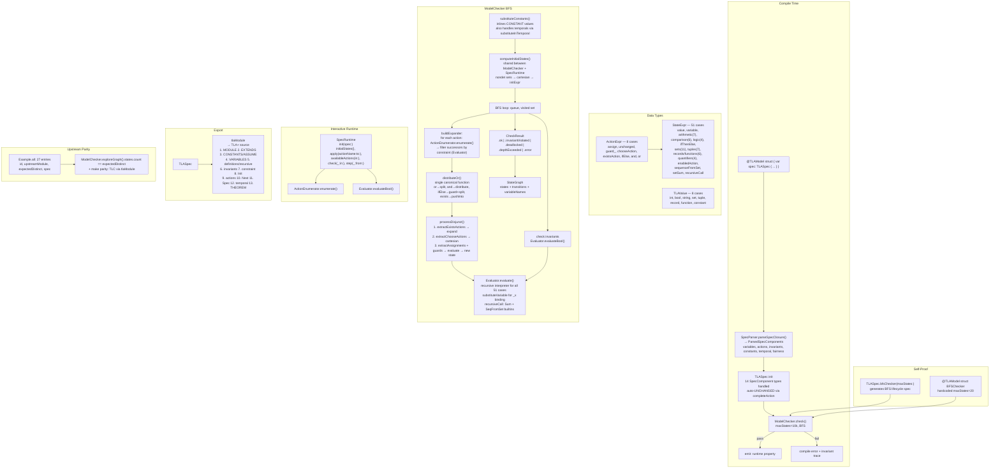

# SwiftTLA language design

SwiftTLA lets an engineer write a bounded formal algorithm in a shape that
feels native to Swift: typed values, scoped result builders, enums for finite
domains, records for structured state, and generated machines for execution.
One authored model becomes a checked formal AST, a TLA+ module, and a typed
Swift state machine.

## One model, several faithful products

SwiftTLA constructs the same formal model along two independent paths, then
compares them before generated code uses it:

```
source syntax → parser → StateExpr/ActionExpr AST
                         ├── compile-time checker
                         ├── .tlaModule
                         └── generated Swift machine surface

constrained builders → runtime TLASpec → SpecRuntime

parser AST ↔ runtime TLASpec semantic alpha-equivalence gate
```

The parser reads the authored Swift syntax. The constrained builders construct
the executable `TLASpec`. Semantic alpha-equivalence confirms that they mean
the same thing, with a diagnostic that identifies the first differing
declaration, action, invariant, or bound expression.

`#spec` is the authoring boundary. It makes Swift declaration sugar such as
`let count = SharedVar(initial: 0)` available to the scoped builder while the
source parser reads the original declaration independently. New conveniences
preserve this two-path construction.

## A small family of scoped builders

SwiftTLA has a small, fixed family of builders. Each builder represents a
formal scope and gives that scope a clear Swift spelling. The type checker uses
those scopes to guide correct construction before macro parsing or model
checking begins.

| Scope | Builder | It accepts | It produces |
|---|---|---|---|
| A complete specification | `#spec { ... }` / `SpecBuilder` | declarations, an `Algorithm`, and formal properties | `TLASpec` components |
| One PlusCal algorithm | `Algorithm { ... }` / `AlgorithmBuilder` | shared state, process families, and formal properties | algorithm components |
| One concurrent process family | `Each(domain) { self in ... }` | labeled atomic regions | one process definition for each finite member |
| One atomic region | `Do(label) { ... }` / `DoBuilder` | guards, assignments, local bindings, branching, and control transfer | one `StepStatement` list, lowered as one transition |

`DoBuilder` produces formal statements for one atomic transition. The generic
part of the API is the data that flows through it: `SharedVariable<Value>`,
`LocalVariable<Value>`, typed records, finite maps, finite domains, and typed
expressions. This keeps an atomic block strongly typed while making its
formal boundary obvious.

```swift
Algorithm("Counter") {
    let count = SharedVar(initial: 0)

    Each(Node.all) { _ in
        Do(Step.advance) {
            When(count < 1)
            Assign(count, to: count + 1)
            Stop()
        }
    }
}
```

Here, `SharedVar` belongs to the algorithm scope, `Each` introduces
independently scheduled finite processes, and `Do` groups the guard,
assignment, and stop into one atomic formal step. The builder layer makes
scope visible in the source and gives Swift a first opportunity to validate
the model.

### Typed formal data

Formal data has the same boundary. A record is declared in the specification
with a named schema, then used through a typed record expression; a finite map
is a typed function; and a finite Swift enum provides the members of a formal
domain. These are not UI-only descriptions. They survive parsing, lowering,
checking, TLA+ emission, and generated Swift state.

| Formal concept | SwiftTLA type | Example |
|---|---|---|
| finite member set | `FiniteDomainKey` enum | `CarID`, `Floor`, `Rider` |
| named total record | `TLARecordSchema` + `Record<Schema>` | a car’s floor, door, and rider |
| named record field | `TLAField<Schema, Value>` | `CarSchema.floor` |
| finite total map | `Function<Domain, Range>` | `Function<CarID, Record<CarSchema>>` |
| shared formal state | `SharedVariable<Value>` | `cars` |

The working elevator model is the reference implementation of this pattern:
`CarSchema` defines validated fields, `cars` is a typed finite function, and
all updates use typed fields rather than string subscripts.

Generated state and transition results use these named Swift types. Formal
names remain behind validated variables, fields, and domains.

### Adding a builder

Each new builder represents a formal scope with its own statements and
lowering rule. A future procedure, macro, or process-local scope may earn a
specific builder; expressions and assignments stay in the scopes that own
them.

Finite nondeterministic initialization is also formal semantics. For example,
`SharedVar(in: SetExpr<Record<CarSchema>>.literal(...))` means that the
initial predicate chooses one member of that typed, finite set. Both paths
retain the complete `initialSet`; it is compared by the fidelity gate and is
not reduced to a Swift collection or display hint.

## Compilation and execution phases

The two paths carry the authored model through the following phases:

1. The Swift compiler type-checks the `#spec` closure. Its result builders
   accept only the supported authoring vocabulary.
2. The `#spec` macro performs syntax-only desugaring. For example, it makes a
   `let count = SharedVar(initial: 0)` declaration visible to the runtime
   builder.
3. The model macro parses the original source independently into the formal
   AST. The checker, TLA+ emitter, and generated machine start from this AST.
4. At runtime, the constrained builder closure runs and independently creates
   a `TLASpec`.
5. SwiftTLA normalizes both models and compares them with semantic
   alpha-equivalence.
6. The generated machine executes the validated transition runtime.

After construction and comparison, the generated machine holds its canonical
state machine and applies enabled transitions.

A structural fingerprint gives a fast diagnostic and cache key. Semantic
alpha-equivalence supplies the formal comparison: it recognizes equivalent
bound-variable names and identifies the semantic node that differs when the
models diverge.

```swift
@TLAModel
struct Counter {
    enum Node: String, FiniteDomainKey { /* bounded members */ }

    static var spec: TLASpec {
        #spec("Counter") {
            Algorithm("Counter") {
                let count = SharedVar(initial: 0)
                Each(Node.all) { _ in
                    Do("advance") {
                        When(count < 1)
                        Assign(count, to: count + 1)
                        Stop()
                    }
                }
            }
        }
    }
}
```

The `#spec` expansion registers `count` with the constrained runtime builder,
while the model macro parses the original declaration into the formal AST.

## Authoring two source forms

PlusCal-shaped authoring expresses algorithms through `Algorithm`, `Each`, and
`Do`; SwiftTLA lowers it into the core AST and emits ordinary TLA+ for TLC.
The typed `#spec` vocabulary also expresses direct TLA+ specifications. Both
forms share the AST, checker, emitter, generated machine, and fidelity gate.

For selected finite core models, the core-conformance command compares the
complete labeled transition relation from SwiftTLA with a pinned TLC run. This
includes initial states, state bindings, action labels, edges, and outcomes.
See `Documentation/CoreGraphConformance.md` and
`Documentation/CoreSupport.md` for the supported cases and commands.

## Finite graph conformance flow

`ModelChecker.explore()` produces one immutable exploration result: its BFS
graph, initial state IDs, checker outcome, and derived completeness come from
the same traversal. The Swift adapter canonicalizes that result without TLC
imports. Separately, TLC invokes the version-bound `LosslessStateWriter`,
which records callbacks as JSONL. The TLC adapter verifies the stream and
provenance, then canonicalizes it. The comparator checks the finite initial
set, state bindings, edge multiset, and outcome after the declared mappings.

The bridge carries complete graph evidence between the Swift and TLC runs.
Trace and replay files make a difference inspectable. Published TLA+ semantics
remain authoritative, with TLC serving as the pinned executable reference.

## Macro and package evidence boundary

The [public workflow conformance](PublicWorkflowConformance.md) command keeps
fixture results for `@TLAModel`, `@TLAActor`, and `@TLAObservable`, together
with the public-library macOS build. It is the release evidence for the
generated public interfaces.

## Generated-machine boundary

The macro derives a canonical Swift machine from the parsed `TLASpec`. The
machine generates typed `State`, `Variables`, `ActionLabel`, and
`TransitionResult` types. A transition result records the typed action and
typed state before and after one successful transition.

The formal engine retains its string-keyed state representation internally.
Application-facing APIs do not expose that map. `TLAStateProjection` validates
formal keys and values before formal tooling can inspect a state. A failed
projection produces a typed diagnostic instead of a partially valid map.

Nested `@TLAActor` and `@TLAObservable` declarations adapt the same canonical
model type. The actor provides isolated access. The nested observable is
main-actor isolated and invokes a typed callback after a transition commits.
Every public generated value is `Sendable`. See
[Generated machines](GeneratedMachines.md) and the SwiftTLA DocC catalog for
the supported surface.

## DSL philosophy

- **Builders everywhere.** Every nested scope has a result builder: `Action { }`,
  `Invariant { }`, `Variable(computed:) { }`, `DefineRecursive { }`,
  `forAll(set) { _ in }`, `filterSet(set) { _ in }`, `exists(name, from:) { _ in }`.
- **1:1 structural match.** DSL structure mirrors upstream TLA+ exactly.
  Same action names, same variable decomposition, same invariant names.
- **No manual `ActionDecl`/`InvDecl`.** All Decl structs have internal inits.
  Only builder functions create spec components.

## Language coverage

| Feature | Status | Notes |
|---------|--------|-------|
| **Variables** | ✓ | Int, Bool, String, Set, Tuple, Function, Record |
| **Init — concrete** | ✓ | `Variable(x, 0)` |
| **Init — nondet** | ✓ | `Variable(x, in: range)` cartesian product |
| **Init — computed** | ✓ | `Variable(computed: x) { expr }` evaluates after nondet expansion |
| **Init — correlated** | ~ | `ComputedVariable` (closure-based) — works but not via builder |
| **Actions — assignment** | ✓ | `x.becomes(expr)` |
| **Actions — unchanged** | ✓ | `x.stays`; `completeAction` auto-adds per-branch |
| **Actions — guard** | ✓ | `guard_expr && action` in builder |
| **Actions — and/or** | ✓ | `&&` / `||` in `Action { }` builder |
| **Actions — IF/THEN/ELSE** | ✓ | `ActionExpr.ifElse(cond, then:, else:)` |
| **Actions — `\E x \in S`** | ✓ | `existsAction` + `ActionExpr.exists(name, from:) { _ in }` |
| **Actions — `\E` SUBSET** | ✓ | `ActionExpr.existsSubset(name, of:) { _ in }` via `powerSet` |
| **CHOOSE** | ✓ | Cartesian product for multi-choose |
| **`\A` over sets** | ✓ | `forAll(set) { _ in }` builder; `StateExpr.forAll(set, body)` |
| **`\E` over sets** | ✓ | `existsIn(set) { _ in }` builder |
| **`{x \in S : P}` — set filter** | ✓ | `filterSet(set) { _ in }` builder |
| **Functions — apply** | ✓ | `f.applying(key)` |
| **Functions — EXCEPT** | ✓ | `f.updated(at: key, to: val)`; nested; `@` self-ref |
| **Functions — domain** | ✓ | `.domain` |
| **Functions — literal** | ✓ | `functionLiteral(var, in: domain, body)`; `TLAValue.function(dict)` |
| **Records — access** | ✓ | `StateExpr.recordAccess(expr, "field")`; `@dynamicMemberLookup` on `Var` for shorthand `msg.type` |
| **Records — literal** | ✓ | `StateExpr.recordLiteral(["field": expr])` |
| **Sequences — Head/Tail** | ✓ | `.head`, `.tail` |
| **Sequences — Append** | ✓ | `.appending(e)` |
| **Sequences — Len** | ✓ | `.count` |
| **Sequences — element** | ✓ | `sequence[index]` or `.at(i)` |
| **Bounded sequence domain** | ✓ | `Sequences(of: values, lengths: 0...n)` |
| **Bounded sorted integer sequence domain** | ✓ | `SortedSequences(of: values, lengths: 0...n)` |
| **Sequences — concatenate** | ✓ | `.concatenating(other)` |
| **Sets — union/intersection/diff** | ✓ | `.union`, `.intersection`, `.subtracting` |
| **Sets — subset** | ✓ | `.isSubset(of:)` |
| **Sets — cardinality** | ✓ | `.cardinality` |
| **Sets — powerset** | ✓ | `.powerSet` |
| **Sets — filter** | ✓ | See set filter above |
| **Arithmetic** | ✓ | +, −, *, /, %, >=, <=, >, <, =, != |
| **SAFETY — invariants** | ✓ | `Invariant("name") { expr }`; `InvariantBuilder` with `for` loop support |
| **SAFETY — deadlock** | ✓ | `DeadlockCheck()` |
| **Constraint** | ✓ | `Constraint(expr)` filters BFS successors; renders `StateConstraint` in `.tlaModule` |
| **CONSTANTS / ASSUME** | ✓ | `Constant(name, value)` emits `CONSTANTS`+`ASSUME`; parity script copies to `.cfg` |
| **Definitions** | ✓ | `Definition(tlaText)` raw TLA+ passthrough |
| **Theorems** | ✓ | `Theorem(tlaText)` raw TLA+ passthrough |
| **RECURSIVE — raw** | ✓ | `Recursive(tlaText)` raw TLA+ passthrough |
| **RECURSIVE — structured** | ✓ | `DefineRecursive(name, params:) { body }` with `@InvariantBuilder` |
| **RECURSIVE — evaluation** | ~ | Builtin `Sum(f,S)` and `SeqFromSet(S)` iterative evaluation; generic recursion not yet |
| **Fairness (WF/SF)** | ~ | Renders correctly in `.tlaModule`; not checked by ModelChecker |
| **Liveness** | — | Not in v1 scope |
| **Temporal properties** | ✓ | `TemporalDecl`, `LeadsTo`, `Eventually`, `AlwaysEventually` — TLA+ output only |
| **INSTANCE / EXTENDS custom** | — | External module dependencies; most TLC configs |
| **PlusCal-shaped algorithms** | ~ | Bounded `Algorithm`, `Each`, `Do`, `When`, `Assert`, `Assign`, `If`, `Either`, `Choose`, `With`, `Goto`, `Stop`; parser and runtime builder have a mandatory semantic-equivalence gate |
| **Refinement mappings** | — | Not in v1 scope |
| **Symmetry reduction** | ~ | `SymmetryDecl` exists; not active |
| **LET in actions** | ✓ | Swift `let` in `Action { }` builder for StateExpr; no ActionExpr-level LET needed |
| **Record field shorthand** | ✓ | `@dynamicMemberLookup` on `Var` — `msg.type` works in builders |
| **Export** | ✓ | `.tlaModule` SANY/TLC-runnable |

## Port inventory

**25/25 TLC parity** — `scripts/validate_upstream_parity.sh` vs [tlaplus/Examples](https://github.com/tlaplus/Examples)

| Spec | States | Key features |
|------|--------|-------------|
| AsynchInterface | 6 | Records, sequences |
| Barrier_N6 | 64 | CHOOSE per-value, counters |
| BinarySearch | 27,963 | PlusCal `while`, scoped `with`, bounded sorted sequences |
| CatOddBoxes / CatEvenBoxes | 30 / 48 | Nondet init |
| Chameneos M=4,N=4 | 34,534 | RECURSIVE Sum, tuples, @ self-ref, existsAction |
| ChangRoberts N=3 | 137 | CHOOSE per-value, per-node actions |
| Channel | 6 | Sequences |
| CigaretteSmokers | 3 | Sets, invariants |
| CoffeeCan (Max100/Max5) | 5,150 / 125 | Nondet init, constraints |
| DieHard TypeOK | 16 | Records, invariants |
| DiningPhilosophers NP=5 | 67 | Records, per-philosopher actions, ExclusiveAccess |
| EWD840 / SyncTD | 192 / 129 | Sequences, counters |
| EWD998 N=4 | 4,097 | Constraint, forAll, nondet init |
| HourClock / HourClock2 | 12 / 12 | Sequences, arithmetic |
| LamportMutex N=2 | 19 | Constraint, nested functions, Head/Tail, @ self-ref |
| Prisoner N=3 | 16 | Counter choice, VictoryOK |
| SimpleAllocator | 400 | Functions, invariants |
| SingleLaneBridge | 3,605 | forAll/filterSet builders, ifElse, RECURSIVE SeqFromSet |
| TCommit | 34 | State machine, invariants |
| TeachingConcurrency N=2,N=3 | 13 / 23 | PlusCal translation, per-node actions |
| TwoPhase | 288 | Records, invariants |

## Rule

**No feature without independent verification**: add a Swift regression test
and, where a bounded external comparison applies, a pinned TLC comparison in
the same change.

**Every nested scope gets a builder.**

## Version

Fragment B v1 — 2026-08-07
## System Flow



## Component Inventory

| Component | File | Input | Output |
|-----------|------|-------|--------|
| `StateExpr` | StateExpr.swift | — | 51-case expression AST |
| `ActionExpr` | ActionExpr.swift | — | 8-case action AST |
| `TLAValue` | TLAValue.swift | — | 8-case runtime value |
| `Var<T>` | Var.swift | name | `.becomes`, `.stays`, `@dynamicMemberLookup` |
| `TLASpec` | TLASpec.swift | DSL builder | immutable spec with 14 component types |
| `Evaluator` | Evaluator.swift | StateExpr + state | TLAValue |
| `ActionEnumerator` | ActionEnumerator.swift | ActionExpr + state | successor states |
| `ModelChecker` | ModelChecker.swift | TLASpec | CheckResult + StateGraph |
| `SpecRuntime` | SpecRuntime.swift | TLASpec | StepResult (6 methods) |
| `SpecParser` | SpecParser.swift | SwiftSyntax | DSL types (7 public methods) |
| `ModelMacro` | ModelMacro.swift | struct source | extension + runtime property |
| `PrettyPrint` | TLASpec+PrettyPrint.swift | TLASpec | .tla string (13-step generation) |
| `distributeOr` | TLASpec+PrettyPrint.swift | ActionExpr | [[ActionExpr]] disjuncts |
| `completeAction` | TLASpec+PrettyPrint.swift | ActionExpr + vars | completed ActionExpr with per-branch UNCHANGED |
| `computeInitialStates` | TLASpec.swift | TLASpec | [[String: TLAValue]] |
| `substituteConstants` | TLASpec.swift | TLASpec | TLASpec with constants inlined |

## Package Structure

```
SwiftTLA (library)
├── SwiftParser, SwiftBasicFormat, SwiftSyntaxBuilder (swift-syntax 600)
│
├── SwiftTLAPlugin (macro)
│   └── SwiftTLA, SwiftCompilerPlugin, SwiftSyntax, SwiftSyntaxMacros
│
├── SwiftTLAMacros (library)
│   └── @attached(member) @attached(extension) macro TLAModel
│
├── SwiftTLAModels (library)
│   └── BFSChecker (@TLAModel), BFSExplorer
│
├── UpstreamParity (library)
│   └── Example.all + 27 port files
│
├── tlc-validate (executable)
│   └── emits .tlaModule for parity validation
│
└── SwiftTLATests (tests)
    └── 133 tests in 30 suites
```

## All Issues Resolved

| # | Issue | Resolution |
|---|-------|-----------|
| 1 | ComputedInitDecl dead code | Removed |
| 2 | SymmetryDecl dead code | Removed |
| 3 | Duplicate init state computation | Extracted shared `computeInitialStates()` |
| 4 | substituteConstants skipped temporals | Added `substituteInTemporal` |
| 5 | Two OR-distribution algorithms | Consolidated to single `distributeOr` |
| 6 | Var.init `value:` parameter | Intentional — type documentation |
| 7 | recursiveCall in substituteVariable | Already handled |
| 8 | SpecBuilder missing overloads | Removed with dead types |

## State (2026-08-07)

- **25/25** TLC parity
- **133** tests in **30** suites
- **51** StateExpr cases, **8** ActionExpr cases, **8** TLAValue cases
- **27** upstream parity ports
- **14** SpecComponent types handled by builder init
