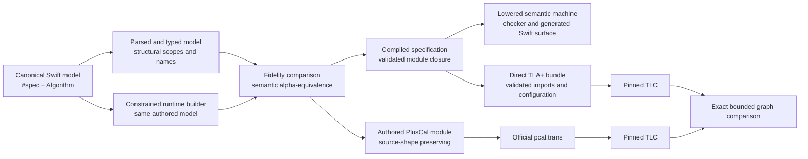

# Stewardship handoff: SwiftTLA

This document is for the next person responsible for SwiftTLA. It explains
what the project is trying to know, how it earns that knowledge, and which
shortcuts would damage the result.

## The philosophical core

SwiftTLA is a compiler for a deliberately supported language embedded in
Swift. It is not a string formatter for TLA+, and it does not claim to
implement every possible TLA+ module.

The normal application author writes one canonical Swift model with `#spec`
and `Algorithm`. That model is the source of truth. It is compiled into formal
and executable forms. No second hand-written Swift copy belongs in a
validation repository.

The central discipline is simple:

> A claim is only as strong as the independent evidence that supports that
> exact claim.

An AST case, a renderer branch, or a passing unit test proves only that the
implementation has reached that boundary. It does not automatically prove
that the construct is authorable, parser-faithful, generated correctly,
linkable, or externally equivalent to the official PlusCal/TLC path.

## The epistemic pipeline

The two Swift construction paths are intentional. The parser reads the
author's source. The constrained builder executes the same model. They must
produce the same formal meaning before lowering proceeds. This detects a
parser/builder disagreement without trusting either path by itself.

The generated Swift machine is also a first-class product. Its typed state,
action labels, and transitions must derive from the compiled model facts. It
must not parse rendered TLA+ back into Swift or invent a parallel transition
semantics.

The renderer is the last, boring phase. It receives scoped, ordered,
already-linked data. If rendering must discover a dependency, repair a binder,
or decide semantic ordering, the preceding compiler phase is incomplete.

## What each boundary establishes

| Boundary | What a pass establishes | What it does not establish |
|---|---|---|
| Swift type checking | The model uses the supported host-language API. | The formal meaning is correct. |
| Parser/builder fidelity | Two independent construction paths agree on the model. | The lowerer or evaluator is correct. |
| Compilation and linking | Names, imports, instances, configurations, and bundle ownership are structurally valid. | A bounded model has the intended behavior. |
| Model checking | The declared finite state space satisfies the checked properties. | Unbounded correctness or external-tool agreement. |
| Generated-machine contract | Typed generated state and actions agree with the compiled machine for the declared finite witness. | Every Swift or TLA+ behavior outside that witness. |
| Official PlusCal plus TLC comparison | The direct Swift-lowered and official translated models have the same declared bounded graph. | Full language equivalence or a theorem about all bounds. |

Never silently promote a lower-level result into a higher-level claim.

## Sources of authority

There is no single magic oracle. Authority is divided on purpose.

| Question | Authority |
|---|---|
| What TLA+/PlusCal means | Published TLA+ semantics and the official PlusCal translator. |
| What an upstream model is | The pinned upstream source and its exact configuration. |
| Whether SwiftTLA's source compiles and its local contracts hold | The repository's GitHub Actions checks. |
| Whether a declared canonical model agrees with official translation and TLC | The separate ValidationEvidence hosted workflow and its retained artifacts. |
| Whether a local edit is worth investigating | The approved local validation wrapper only. Local results are diagnostic, never admission evidence. |

The external validation repository is an oracle runner. It owns pinned tools,
time limits, artifact retention, and admission decisions. It must consume the
source-owned canonical model artifact unchanged. It must not become a second
place to reimplement algorithms.

## Names, scope, ordering, and linking are semantics

Treat these as compiler concerns, not formatting details.

- Binders from `With`, `Choose`, quantifiers, functions, `LET`, process
  parameters, and local variables are structural nodes. Rename them
  capture-safely. Never repair them with string replacement.
- A module section order is part of validity. A definition must exist before
  an algorithm or `INSTANCE` that uses it.
- Module resolution is linking. Resolve the full transitive closure, preserve
  provenance and digests, and reject a missing or conflicting module before
  PlusCal or TLC starts.
- An action-label mapping is allowed only when declared, explicit, and tested.
  Do not normalize a mismatch into agreement.

VoteProof and KVsnap made these lessons concrete: their failures were linker,
section-order, and label-boundary failures, not mysterious failures of formal
semantics.

## How to add a language capability

For every new construct, answer these questions before calling it supported:

1. **Representation:** Which existing typed AST/IR node represents it? Add a
   node only when no existing one has the right semantics.
2. **Authoring:** What is the one canonical `#spec`/`Algorithm` spelling?
3. **Scope:** Which names bind, where are they visible, and how does alpha
   equivalence treat them?
4. **Execution:** Can the finite evaluator and checker execute it, or is it
   intentionally export-only?
5. **Lowering:** Does the one lowerer preserve its semantics and source-level
   identity?
6. **Generation:** Does the generated typed machine receive the same state
   fields and action labels from compiled facts?
7. **Linking:** Which imported modules and pinned external files are required?
8. **Evidence:** What is the smallest authoritative upstream model that proves
   the behavior through official translation and TLC?

If a capability stops at any boundary, record that honestly as its current
support level. Do not build a special bypass for one example.

## The project-wide cleanliness rule

Cleanliness is part of epistemic discipline. Redundant paths create false
confidence because they obscure which implementation is actually trusted.

- Keep one canonical Swift model per upstream example.
- Delete compatibility APIs and migrate every caller in the same change. Do
  not preserve aliases, deprecated spellings, or fallback renderers.
- Keep raw `[String: TLAValue]` maps inside formal-engine, parser, renderer,
  or serialization boundaries. Application-facing APIs use generated typed
  `State`, `Variables`, and `ActionLabel` values.
- Name tests for the behavior or compiler contract they prove. An upstream
  model name is allowed only as corpus provenance, such as
  `VoteProofCorpusRenderingTests`.
- Do not use a generic style linter as the judge of compiler quality. Compiler
  code needs recursion, exhaustive dispatch, source locations, and generated
  source. Prefer focused structural checks and review criteria.
- Every implementation task receives a deletion-first Ponytail review and an
  independent task review. A passing test suite does not excuse a retained
  obsolete path.

## How to investigate a failure

Classify the first broken boundary and fix there. Do not rerun expensive
external validation until the named local boundary has a regression test.

| Symptom | First place to inspect |
|---|---|
| A canonical source model cannot compile | Supported authoring API, parser/builder fidelity, or explicit diagnostic. |
| A name is missing or captured incorrectly | Structural binder/scope representation. |
| PlusCal or TLC cannot find a module | Compiled bundle/link closure and pinned imports. |
| A definition appears after use | Section plan before rendering. |
| Generated Swift differs from formal behavior | Generated-machine metadata and bounded contract witness. |
| Direct and translated TLC graphs differ | Preserved artifacts, declared mappings, source shape, then lowerer semantics. |

Retain the exact source, configuration, tool identities, commands, and graph
artifacts that produced a difference. A count comparison is diagnostic; the
claiming comparison is over canonical initial states, state bindings, labeled
edges, and outcome.

## Things the next steward should not do

- Do not make the renderer cleverer to conceal missing IR, scopes, or links.
- Do not create a duplicate runtime fixture because an external harness is
  inconvenient to compile. Fix the artifact boundary.
- Do not call an implementation "supported" from an evaluator branch alone.
- Do not replace an upstream model with a convenient equivalent.
- Do not infer a label mapping or module dependency from printed text.
- Do not use direct local TLC or broad test commands outside the repository
  validation wrapper.
- Do not keep compatibility paths because they make a migration easier.

## Current direction

The compiler-pipeline hardening work established the key boundaries:

- a compiled specification is the validated input to machine generation and
  formal output;
- module closure and ownership are checked before rendering/materialization;
- canonical corpus export starts from compiled source-owned models;
- generated-machine metadata is derived from compiled facts and compared with
  bounded formal behavior;
- independent hosted evidence compares direct Swift-lowered TLA+ with official
  PlusCal translation and TLC for declared finite models.

The next work should be consolidation, not invention: remove residual
compatibility surfaces, keep documentation synchronized with current public
boundaries, split mixed-purpose tests by contract, and add language coverage
only through the complete evidence chain above.

## Steward's compact checklist

Before merging a meaningful change, ask:

1. Is there exactly one source of formal meaning?
2. Did we preserve binding, ordering, and module closure structurally?
3. Did we delete the old path rather than add a compatibility layer?
4. Does each test name the contract it establishes?
5. What is the strongest claim the retained evidence actually supports?
6. If this is a new language construct, which evidence boundary is still
   missing?

If those answers are clear, the project stays a compiler with an honest
evidence chain instead of becoming a collection of plausible-looking Swift
that prints TLA+.
