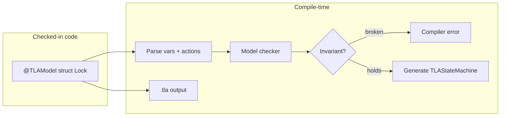
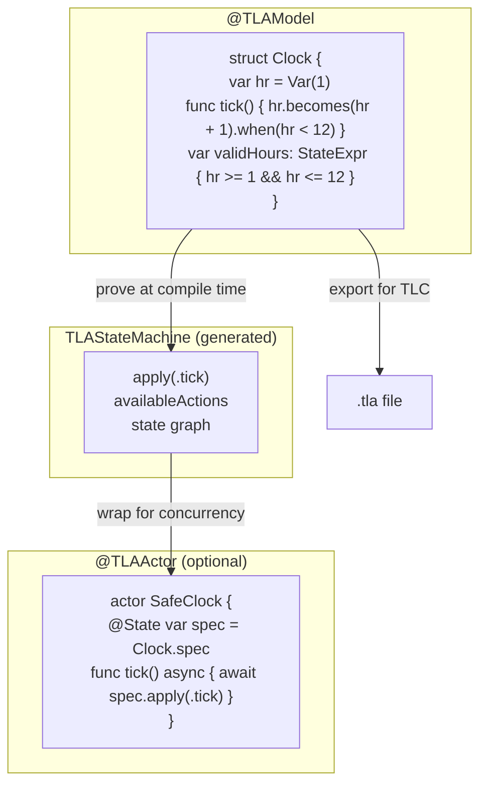

# SwiftTLA

Write specs in Swift. The compiler proves them. Output a `.tla` file for external audit by TLC.



```swift
import SwiftTLA
import SwiftTLAGeneration
import SwiftTLAMacros

@TLAModel
struct HourClock {
    var hr = Var(1)

    func tick() {
        hr.becomes(hr + 1).when(hr < 12)
        hr.becomes(1).when(hr == 12)
    }

    var validHours: StateExpr { hr >= 1 && hr <= 12 }
}
```

Compiles → 12 states verified. Broken invariant → compiler error.

```swift
print(HourClock.spec.tlaModule)
// ---- MODULE HourClock ----
// VARIABLES hr
// Init == hr = 1
// tick == ...
// ====
```

---

## Three layers



`@TLAModel` proves the spec. `TLAStateMachine` runs it. `@TLAActor` wraps it in Swift concurrency.

---

## The code you check in

```swift
@TLAModel
struct Lock {
    var isLocked = Var(0)

    func lock()   { isLocked.becomes(1).when(isLocked == 0) }
    func unlock() { isLocked.becomes(0).when(isLocked == 1) }

    var binary: StateExpr { isLocked >= 0 && isLocked <= 1 }
}
```

Four special words: `@TLAModel`, `Var`, `.becomes().when()`, `StateExpr`. Everything else is plain Swift.

| Element | Reads like |
|---|---|
| `var isLocked = Var(0)` | A variable, starts at 0 |
| `func lock()` | An atomic action |
| `isLocked.becomes(1)` | In the next state, isLocked equals 1 |
| `.when(isLocked == 0)` | Only when isLocked is currently 0 |
| `var binary: StateExpr` | An invariant that must always hold |

---

## API

| Expression | Meaning |
|---|---|
| `x.becomes(expr)` | x' = expr |
| `x.becomes(expr).when(cond)` | cond ∧ x' = expr |
| `x.stays` | UNCHANGED x |
| `x == y`, `x + y`, `x < y` | state expressions (arithmetic and Boolean) |
| `x.isIn(S)`, `S.union(T)`, `S.subtracting(T)` | set operations |
| `S.cardinality`, `S.flattened`, `S.subsets` | set properties |
| `f.applying(a)`, `f.updated(at: k, to: v)` | function operations |
| `StateExpr.for(allIn: S, ...)`, `.exists(in: S, ...)` | quantifiers |
| `StateExpr.set([...])`, `.tuple([...])`, `.record([...])` | literals |

Operators (domain notation): `∈`, `⊆`, `∪`, `∩`.

---

## Run the demo

```
swift run demo
```

16 examples. Interactive views. Side-by-side `@TLAModel` and TLA+ panels.

```swift
.package(url: "https://github.com/RoyalPineapple/SwiftTLA", branch: "main")
```
