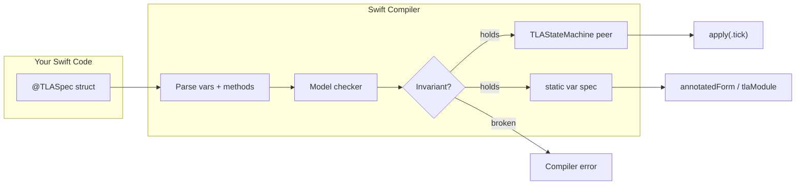
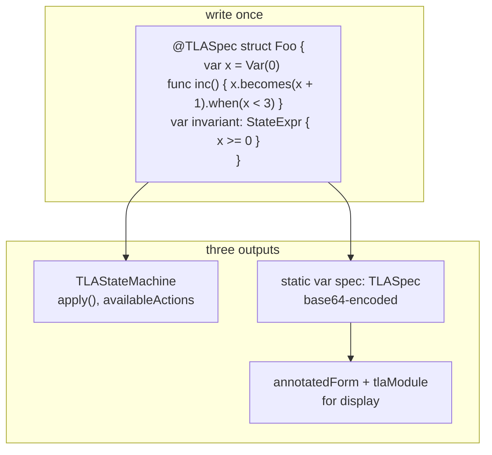

# SwiftTLA

Specification language that IS Swift. Write TLA+ specs as `@TLASpec` structs. The compiler checks invariants at build time. The same struct produces a valid `.tla` file for TLC audit.





---

## Quick start

```swift
import SwiftTLA
import SwiftTLAGeneration
import SwiftTLAMacros

@TLASpec
struct HourClock {
    var hr = Var(1)

    func tick() {
        hr.becomes(hr + 1).when(hr < 12)
        hr.becomes(1).when(hr == 12)
    }

    var validHours: StateExpr { hr >= 1 && hr <= 12 }
}
```

`swift build` checks the invariant at compile time. The expanded type includes:

```
TLAStateMachine     —  apply(.tick), availableActions, 12 states
HourClock.spec      —  TLASpec for formatted output
HourClock.annotatedForm  —  @TLASpec self-portrait
HourClock.spec.tlaModule —  valid .tla file
```

---

## Externally auditable

```swift
print(HourClock.spec.tlaModule)
```

```tla
---- MODULE HourClock ----
EXTENDS Naturals, FiniteSets, Sequences

VARIABLES hr

Init == hr = 1

tick == (hr < 12) /\ hr' = hr + 1 \/ (hr == 12) /\ hr' = 1

Next == tick

====
```

TLC verifies the same property independently.

---

## Architecture

```mermaid
graph TD
    subgraph Libraries
        TLA[SwiftTLA\nStateExpr, ActionExpr, TLAValue,\nVar, TLASpec, ModelChecker]
        GEN[SwiftTLAGeneration\nPretty-printer, StateMachineGenerator,\nbase64 JSON codec]
    end
    subgraph Plugin
        MAC[SwiftTLAPlugin\n@TLASpec macro\nparse struct → checker → codegen]
        DEC[SwiftTLAMacros\nMacro declarations]
    end
    subgraph Ship
        EX[SwiftTLAExamples\n16 example specs]
        DM[SwiftTLADemo\nSwiftUI app: sidebar, interactive,\nside-by-side panels]
    end
    DM --> EX --> TLA
    DM --> GEN --> TLA
    MAC --> TLA
    MAC --> GEN
    DEC --> MAC
```

---

## Public API

| Expression | Meaning | TLA+ |
|---|---|---|
| `x.becomes(expr)` | x' = expr | `x' = expr` |
| `x.becomes(expr).when(cond)` | guarded assignment | `cond /\ x' = expr` |
| `x.stays` | x unchanged | `UNCHANGED x` |
| `x == y` | equality | `x = y` |
| `x + y`, `x - y`, `x * y` | arithmetic | `x + y`, etc. |
| `x < y`, `x <= y`, `x > y`, `x >= y` | comparisons | `x < y`, etc. |
| `x.isIn(S)` | set membership | `x \in S` |
| `S.union(T)` | set union | `S \cup T` |
| `S.intersection(T)` | set intersection | `S \cap T` |
| `S.subtracting(T)` | set difference | `S \ T` |
| `S.isSubset(of: T)` | subset | `S \subseteq T` |
| `S.cardinality` | cardinality | `Cardinality(S)` |
| `S.flattened` | union of all elements | `UNION S` |
| `S.subsets` | power set | `SUBSET S` |
| `S.domain` | function domain | `DOMAIN S` |
| `S.filtering(p)` | set filter | `{x ∈ S : p}` |
| `S.mapping(e)` | set map | `{e : x ∈ S}` |
| `f.applying(a)` | function application | `f[a]` |
| `f.updated(at: k, to: v)` | function except | `[f EXCEPT ![k] = v]` |
| `StateExpr.set([a, b])` | set literal | `{a, b}` |
| `StateExpr.tuple([a, b])` | tuple literal | `<<a, b>>` |
| `StateExpr.record(["f": a])` | record literal | `[f ↦ a]` |
| `StateExpr.for(allIn: S, p)` | universal quantification | `∀ x ∈ S : p` |
| `StateExpr.exists(in: S, p)` | existential quantification | `∃ x ∈ S : p` |
| `StateExpr.choose(from: S, matching: p)` | CHOOSE | `CHOOSE x ∈ S : p` |
| `StateExpr.function(domain: S, body)` | function literal | `[x ∈ S ↦ body]` |
| `StateExpr.enabled("Act")` | enabled predicate | `ENABLED Act` |
| `ActionExpr.choose("v", from: S)` | nondeterministic choose | `v' ∈ S` |

Operators (domain notation): `∈`, `⊆`, `∪`, `∩`.

---

## Liveness

`@TLASpec` structs can declare temporal properties and fairness:

```swift
@TLASpec
struct Progress {
    var x = Var(0)
    func inc() { x.becomes(x + 1).when(x < 5) }
    var eventuallyDone: TemporalExpr { x.leadsTo(x == 5) }
    var fairInc: FairnessCondition { .weakFairness("inc") }
}
```

Checker uses Tarjan SCC decomposition with fairness constraints.

---

## Run the demo

```
swift run demo
```

16 examples in the sidebar. Interactive views for HourClock, DieHard, CoffeeCan. Graph-driven exploration for all others. Side-by-side `@TLASpec` and TLA+ panels with copy buttons.

Add a dependency:

```swift
.package(url: "https://github.com/RoyalPineapple/SwiftTLA", branch: "main")
```
